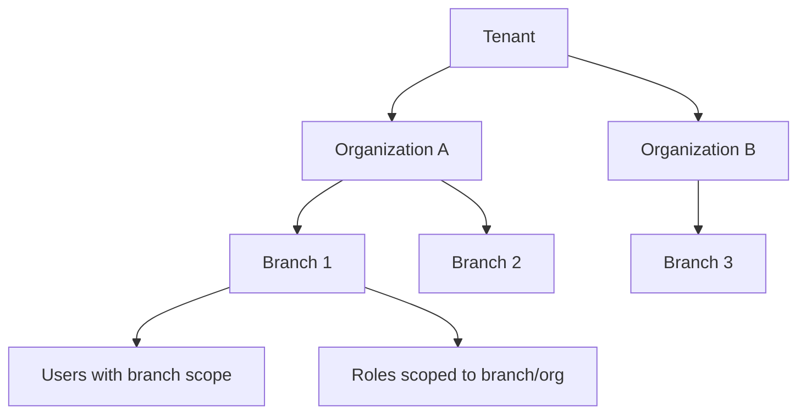
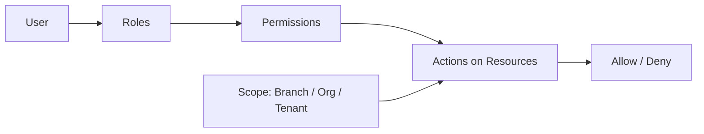
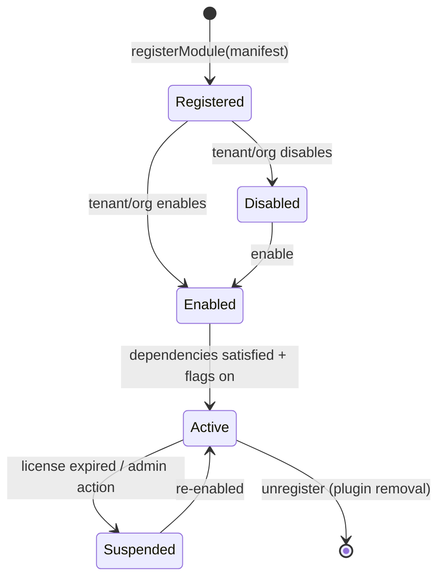
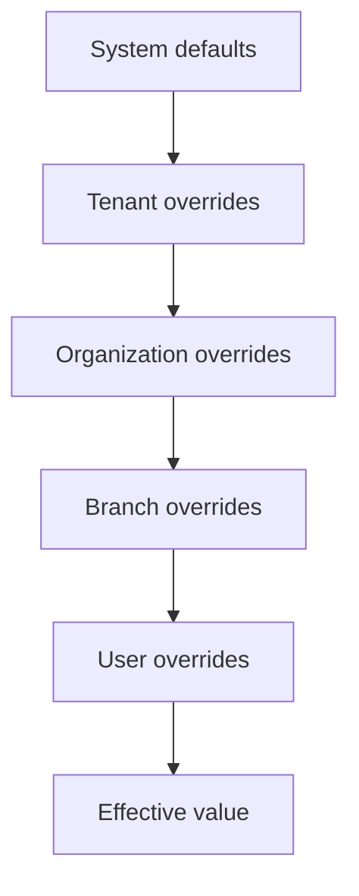
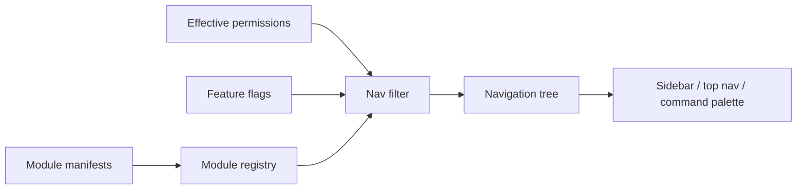
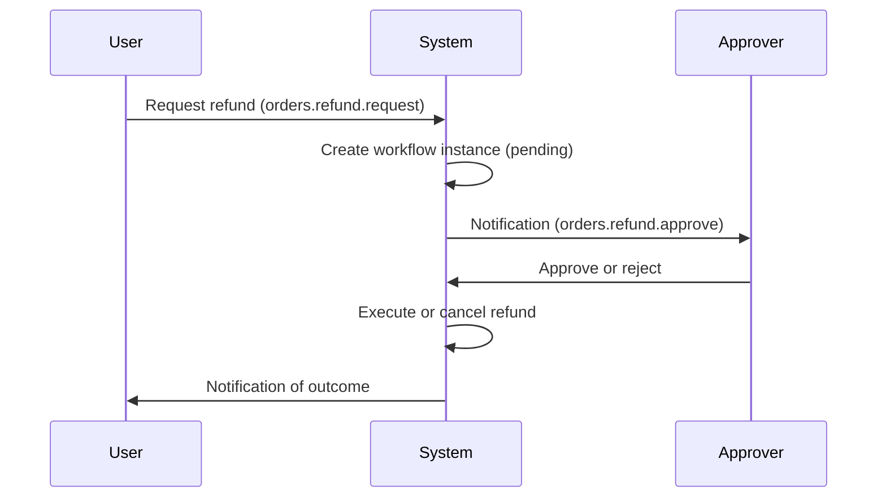
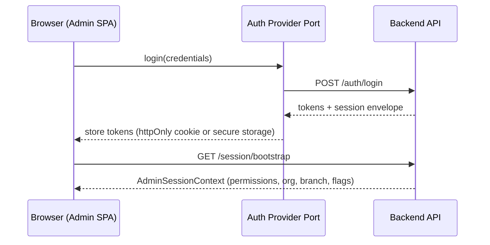
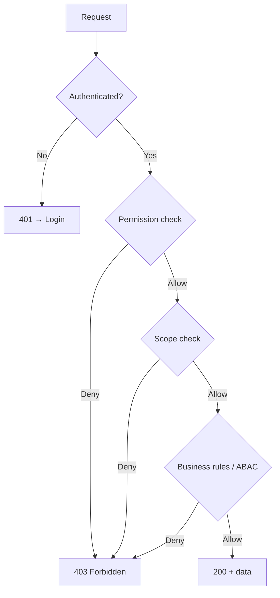
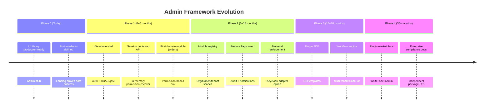

# Enterprise Admin Architecture

**Status:** Architecture / Technical Design Document  
**Audience:** Platform architects, senior engineers, security reviewers  
**Scope:** Admin Framework infrastructure — domain-independent, SaaS-ready  
**Stack:** React + TypeScript + Vite + Nx Monorepo  
**Related:** [Admin docs index](./README.md) · [FUTURE-PLAN.md](../FUTURE-PLAN.md) · [packages.md](../packages.md)

---

## Document purpose

This document defines the **target architecture** for the Enterprise Admin Framework. It is not an implementation guide. It establishes conventions, boundaries, and extension points so that:

- A restaurant admin panel can ship today as a **sample domain**
- CRM, ERP, hospital, warehouse, and e-commerce admin panels can reuse the same foundation tomorrow
- Multi-tenant SaaS, RBAC, audit, and plugin modules can be added without breaking changes

---

## Table of contents

1. [Vision](#1-vision)
2. [Core Principles](#2-core-principles)
3. [Core Concepts](#3-core-concepts)
4. [Authorization Architecture](#4-authorization-architecture)
5. [System Roles](#5-system-roles)
6. [Resources](#6-resources)
7. [Permission Naming Convention](#7-permission-naming-convention)
8. [Module Architecture](#8-module-architecture)
9. [Feature Flags](#9-feature-flags)
10. [Navigation Architecture](#10-navigation-architecture)
11. [User Profile Architecture](#11-user-profile-architecture)
12. [Notification Architecture](#12-notification-architecture)
13. [Audit Architecture](#13-audit-architecture)
14. [Workflow Support](#14-workflow-support)
15. [Branch Architecture](#15-branch-architecture)
16. [File Management](#16-file-management)
17. [Future Ready Modules](#17-future-ready-modules)
18. [Security Considerations](#18-security-considerations)
19. [Architectural Recommendations](#19-architectural-recommendations)
20. [Future Expansion](#20-future-expansion)

---

## 1. Vision

### Purpose

The Enterprise Admin Framework is a **reusable administrative shell** for SaaS and enterprise products. It provides the cross-cutting infrastructure every serious back-office needs — authentication, authorization, organization hierarchy, navigation, settings, notifications, audit, and modular domain features — while keeping **business logic domain-pluggable**.

### What it is

- An **Application Platform** admin layer (see [FUTURE-PLAN.md](../FUTURE-PLAN.md))
- A **composition root** for React admin SPAs built with Vite
- A **contract-first** system: ports for auth, permissions, feature flags, logging, and data access
- A **design-system-driven** UI built on `@enterprise/ui`

### What it is not

- A restaurant-only admin panel
- A generic CRUD generator
- A monolithic framework with hidden magic (`BaseRepository`, `EnterpriseCore` singletons)
- A replacement for domain-specific business rules

### North-star outcome

> A team can scaffold Landing + Dashboard + **Admin + Auth + RBAC + i18n + theme + API layer** and ship a production SaaS admin in days — not months — by enabling modules and configuring organizations, not by rewriting infrastructure.

### Sample domain vs platform

| Layer                       | Restaurant sample | Platform (reusable)      |
| --------------------------- | ----------------- | ------------------------ |
| Orders, menu, kitchen       | Domain modules    | Plugin / feature modules |
| Auth, RBAC, branches        | Platform core     | Platform core            |
| Navigation, settings, audit | Platform core     | Platform core            |
| UI shell, tables, forms     | `@enterprise/ui`  | `@enterprise/ui`         |

---

## 2. Core Principles

| Principle                         | Definition                                                                        | Why it matters                                               |
| --------------------------------- | --------------------------------------------------------------------------------- | ------------------------------------------------------------ |
| **Scalability**                   | Horizontal tenant growth, large permission sets, many branches                    | SaaS products outgrow single-tenant assumptions quickly      |
| **Modularity**                    | Features ship as isolated modules with explicit metadata                          | Enables plugin architecture and team parallelization         |
| **Separation of concerns**        | UI, application use cases, repositories, and platform ports are distinct layers   | Prevents admin pages from becoming untestable god components |
| **Domain independence**           | Platform vocabulary uses Organization, Branch, Permission — not Menu, Table, Chef | Same admin shell serves hospital, CRM, or warehouse          |
| **SaaS ready**                    | Tenant, org, and branch scopes are first-class                                    | Avoids costly rewrites when second customer arrives          |
| **Extensibility**                 | Ports at vendor boundaries (`AuthProvider`, `PermissionChecker`)                  | Keycloak, Clerk, or built-in auth without feature rewrites   |
| **Convention over configuration** | Fixed folder layout, predictable permission naming, declarative navigation        | Reduces cognitive load; enables CLI/codegen later            |
| **Defense in depth**              | AuthN at session layer; AuthZ at UI + route + API layers                          | UI hiding alone is never sufficient                          |
| **Audit everything meaningful**   | Security-sensitive and financial actions leave immutable trails                   | Enterprise compliance and incident response                  |
| **Fail closed**                   | Missing permission, unknown scope, or expired session → deny                      | Prevents privilege escalation via defaults                   |

### Alignment with existing ADRs

The landing app established patterns the admin app **must inherit**:

- **Feature ownership** ([ADR-001](../architecture/ADR-001-feature-ownership.md)): domain UI in `features/`, not global `components/`
- **Data flow** ([ADR-002](../architecture/ADR-002-data-flow.md)): route → application → repository → datasource
- **Repository pattern** ([ADR-003](../architecture/ADR-003-repository-pattern.md)): factory + datasource injection at composition root
- **No forbidden folders**: no `shared/`, `common/`, `helpers/` inside apps

Admin adds platform layers **above** these conventions: session context, permission gates, module registry, and scope-aware navigation.

---

## 3. Core Concepts

### Hierarchy model



### Concept glossary

| Concept          | Definition                                                                                        | Example                                  |
| ---------------- | ------------------------------------------------------------------------------------------------- | ---------------------------------------- |
| **Tenant**       | Top-level SaaS isolation boundary. Owns billing, global config, and all organizations beneath it. | `acme-corp` on `app.example.com`         |
| **Organization** | Business entity within a tenant. Owns users, roles, settings, and enabled modules.                | "Acme Restaurants LLC"                   |
| **Branch**       | Operational unit within an organization. Primary **data scope** for day-to-day staff.             | "Downtown Location", "Warehouse East"    |
| **User**         | Authenticated identity. Belongs to one or more organizations; may have branch assignments.        | `jane@acme.com`                          |
| **Role**         | Named bundle of permissions for a job function. **Convenience, not authority.**                   | `branch-manager`, `cashier`              |
| **Permission**   | Atomic authorization unit. **Defines behavior.**                                                  | `orders.cancel`, `inventory.adjust`      |
| **Scope**        | Context dimension applied to authz decisions: system, tenant, organization, branch, or self.      | Branch-scoped order list                 |
| **Module**       | Pluggable domain or platform feature with metadata, routes, permissions, and lifecycle.           | `orders`, `inventory`, `hr`              |
| **Feature**      | Capability toggled independently of RBAC (may also require permissions).                          | `ai-menu-assistant`                      |
| **Resource**     | Entity type permissions attach to.                                                                | `orders`, `users`, `invoices`            |
| **Navigation**   | Permission-derived menu and route graph. Never hardcoded per role name.                           | Sidebar built from `NavigationManifest`  |
| **Settings**     | Configuration at system, org, branch, or user level.                                              | Tax rate, receipt template, theme        |
| **Audit**        | Immutable record of who did what, when, where, and in which scope.                                | Order cancellation by user X at branch Y |
| **Notification** | Scoped message delivery to users, roles, branches, or entire org.                                 | "Inventory low at Branch 2"              |
| **Profile**      | User-owned preferences and security settings.                                                     | Avatar, 2FA, timezone                    |
| **Session**      | Authenticated context: user, active org, active branch, permissions, feature flags.               | JWT + server-side session enrichment     |

### Session context (target shape)

The admin SPA operates within an enriched session. All authorization and navigation decisions derive from this context — never from ad-hoc globals.

```typescript
// Target contract — documentation only, not implemented
type AdminSessionContext = {
  user: { id: string; email: string; displayName: string };
  tenant: { id: string; slug: string };
  organization: { id: string; name: string };
  branch: { id: string; name: string } | null; // null = org-wide context
  roles: readonly string[];
  permissions: ReadonlySet<string>; // resolved effective permissions
  featureFlags: ReadonlyMap<string, boolean | string | number>;
  impersonation?: { actorId: string; startedAt: string };
};
```

---

## 4. Authorization Architecture

Authorization is the **central nervous system** of the admin framework. Authentication proves identity; authorization decides what that identity may do **in the current scope**.

### Authentication vs authorization

| Concern                    | Question               | Layer                         | Package                   |
| -------------------------- | ---------------------- | ----------------------------- | ------------------------- |
| **Authentication (AuthN)** | Who is this user?      | Session, tokens, login        | `@enterprise/auth`        |
| **Authorization (AuthZ)**  | What may they do here? | Permissions, scopes, policies | `@enterprise/permissions` |

### Current codebase alignment

The monorepo already defines port interfaces:

```typescript
// packages/auth — token/session boundary
interface AuthBoundary {
  getSession(): AuthSession;
  refreshTokens(): Promise<AuthTokens | null>;
  clearSession(): void;
}

// packages/permissions — RBAC checker
interface PermissionChecker {
  can(permission: Permission): boolean;
  canAny(permissions: readonly Permission[]): boolean;
  canAll(permissions: readonly Permission[]): boolean;
}
```

**Target:** Admin features depend on these ports — never on vendor SDKs (`@clerk/*`, Keycloak client) directly.

### Authorization model: RBAC + permissions



| Layer           | Mechanism                     | Purpose                                 |
| --------------- | ----------------------------- | --------------------------------------- |
| **Roles**       | Job-function groupings        | Simplify admin UX when assigning access |
| **Permissions** | Atomic grants                 | Actual enforcement unit                 |
| **Policies**    | Server-side rule sets         | Source of truth; UI mirrors server      |
| **Scopes**      | Branch / org / tenant context | Data isolation                          |

**Critical rule:** Roles are **labels**. Permissions are **law**. Never check `user.role === 'admin'` in feature code.

### Permission-based access

Every protected surface checks permissions explicitly:

| Surface              | Check                      | On deny                                  |
| -------------------- | -------------------------- | ---------------------------------------- |
| Route                | `permission` on route meta | Redirect to `/403` or fallback dashboard |
| Navigation item      | `permissions` on nav node  | Item hidden (not merely disabled)        |
| Page action (button) | `can('resource.action')`   | Hidden or disabled with tooltip          |
| API request          | Server guard (mandatory)   | `403 Forbidden`                          |
| Data query           | Scope filter + permission  | Empty set or `403`                       |

UI checks are **UX only**. Server enforcement is **authoritative**.

### Branch scope

Most operational staff work within a **single active branch**. Authorization must combine:

1. **Permission** — e.g. `orders.view`
2. **Scope** — user can only see orders where `order.branchId === session.branch.id`

Exceptions:

| Actor        | Branch behavior                               |
| ------------ | --------------------------------------------- |
| Branch staff | Strict branch isolation                       |
| Org admin    | May switch branch or view all branches in org |
| Super admin  | Cross-tenant / cross-org bypass with audit    |

### Future ABAC compatibility

Attribute-Based Access Control (ABAC) extends RBAC without replacing it:

| RBAC today      | ABAC extension                                                           |
| --------------- | ------------------------------------------------------------------------ |
| `orders.cancel` | `orders.cancel` WHEN `order.total < 1000` AND `order.status = 'pending'` |
| Role: Manager   | Attribute: `user.department = 'finance'`                                 |

**Design decision:** Keep permissions as stable string identifiers. ABAC policies **evaluate** whether a held permission applies in context. Do not encode business rules into permission names (avoid `orders.cancel_under_1000`).

Policy evaluation order (target):

1. Super admin bypass (audited)
2. Explicit deny (if supported)
3. Temporary grants / revocations
4. Role-derived permissions
5. ABAC contextual rules
6. Default deny

### Permission inheritance

| Level        | Inherits from          | Example                           |
| ------------ | ---------------------- | --------------------------------- |
| System       | —                      | `system.modules.enable`           |
| Tenant       | System defaults        | Tenant enables `inventory` module |
| Organization | Tenant + org overrides | Org disables `marketing` module   |
| Branch       | Organization           | Branch-specific role assignments  |
| User         | Roles + direct grants  | User gets extra `reports.export`  |

Inheritance flows **down** the hierarchy. A child scope cannot grant what a parent explicitly denied (fail closed).

### Temporary permissions

For shift coverage, approvals, or break-glass access:

| Field         | Purpose                         |
| ------------- | ------------------------------- |
| `permission`  | Granted permission key          |
| `granteeId`   | User receiving temporary access |
| `grantedById` | Approver                        |
| `scope`       | Branch / org                    |
| `expiresAt`   | Auto-revoke timestamp           |
| `reason`      | Audit justification             |

Temporary grants merge into effective permissions at session refresh. Expired grants are ignored.

### Super admin bypass

Super admins can operate across tenants and organizations for platform operations.

| Requirement                          | Rationale                                  |
| ------------------------------------ | ------------------------------------------ |
| Separate role (`system.super-admin`) | Distinct from org admin                    |
| Mandatory audit on every action      | Prevents silent cross-tenant access        |
| Optional impersonation flow          | Support debugging with user consent policy |
| Visual indicator in UI               | "Acting as Super Admin" banner             |
| Time-limited elevation               | Break-glass, not permanent default         |

---

## 5. System Roles

Roles are **examples** for common job functions. They exist to simplify assignment UX. **Permissions define actual behavior.**

### Role catalog (examples)

| Role                   | Typical scope | Primary responsibilities                              |
| ---------------------- | ------------- | ----------------------------------------------------- |
| **Super Admin**        | System        | Tenant management, module enablement, platform config |
| **Organization Admin** | Organization  | Users, roles, org settings, all branches              |
| **Branch Manager**     | Branch        | Staff, daily operations, local reports                |
| **Cashier**            | Branch        | POS, payments, receipts                               |
| **Kitchen Staff**      | Branch        | Order preparation, kitchen display                    |
| **Waiter**             | Branch        | Table service, order taking                           |
| **Delivery**           | Branch        | Delivery assignment, status updates                   |
| **Inventory Manager**  | Branch / Org  | Stock, suppliers, transfers                           |
| **Marketing**          | Organization  | Campaigns, coupons, content                           |
| **SEO**                | Organization  | Meta, redirects, sitemap config                       |
| **Accountant**         | Organization  | Invoices, ledger, tax reports                         |
| **Support**            | Organization  | Customer tickets, refunds (limited)                   |
| **HR**                 | Organization  | Employees, attendance, leave                          |
| **Auditor**            | Organization  | Read-only audit and reports                           |
| **Call Center**        | Organization  | Customer lookup, order assistance                     |
| **Customer Support**   | Organization  | Ticket resolution, limited order actions              |

### Role design rules

1. **Roles never checked in feature code** — check permissions
2. **Roles are tenant-configurable** — customers rename or combine roles
3. **System roles** (`system.*`) are platform-owned and not editable by tenants
4. **Default role templates** ship per vertical (restaurant, CRM) as **presets**, not hardcoded logic
5. **One user, many roles** — effective permissions are the union minus explicit denies

### Example role → permission mapping (restaurant preset)

| Role               | Sample permissions (subset)                                                |
| ------------------ | -------------------------------------------------------------------------- |
| Cashier            | `orders.create`, `orders.view`, `payments.capture`                         |
| Kitchen Staff      | `orders.view`, `orders.update-status.kitchen`                              |
| Branch Manager     | `orders.*`, `users.view`, `reports.branch`, `inventory.view`               |
| Organization Admin | `users.manage`, `roles.assign`, `settings.organization`, `branches.manage` |

---

## 6. Resources

Resources are entity types the system manages. Permissions attach to resources via actions (see [§7](#7-permission-naming-convention)).

### Platform resources

| Resource        | Description                             |
| --------------- | --------------------------------------- |
| `users`         | User accounts and invitations           |
| `roles`         | Role definitions                        |
| `permissions`   | Permission catalog (read-only for most) |
| `organizations` | Organization CRUD and settings          |
| `branches`      | Branch CRUD and settings                |
| `tenants`       | SaaS tenant management (super admin)    |
| `modules`       | Module enablement                       |
| `feature-flags` | Feature flag administration             |
| `settings`      | System / org / branch / user settings   |
| `navigation`    | Dynamic nav overrides (admin-only)      |
| `audit-logs`    | Audit trail access                      |
| `notifications` | Notification templates and delivery     |
| `files`         | File manager assets                     |
| `sessions`      | Active session management               |
| `api-keys`      | Programmatic access tokens              |
| `webhooks`      | Outbound webhook config                 |
| `integrations`  | Third-party connectors                  |
| `jobs`          | Background job monitoring               |
| `reports`       | Report definitions and exports          |
| `analytics`     | Dashboards and metrics                  |
| `workflows`     | Approval workflow definitions           |

### Domain resources (examples — pluggable)

| Domain         | Resources                                                         |
| -------------- | ----------------------------------------------------------------- |
| **Restaurant** | `orders`, `menu`, `tables`, `reservations`, `kitchen-tickets`     |
| **Commerce**   | `products`, `categories`, `carts`, `checkout`, `shipments`        |
| **Inventory**  | `inventory`, `stock-movements`, `suppliers`, `purchase-orders`    |
| **Accounting** | `invoices`, `payments`, `expenses`, `ledger-entries`, `tax-rates` |
| **CRM**        | `customers`, `leads`, `deals`, `pipelines`, `activities`          |
| **HR**         | `employees`, `attendance`, `leaves`, `payroll`, `departments`     |
| **Marketing**  | `campaigns`, `coupons`, `loyalty-programs`, `email-templates`     |
| **Support**    | `tickets`, `sla-policies`, `canned-responses`                     |
| **Content**    | `blog-posts`, `pages`, `media`, `redirects`                       |
| **Chat**       | `conversations`, `messages`, `channels`                           |

Resources are registered by **modules**. The platform core owns platform resources; domain modules own domain resources.

---

## 7. Permission Naming Convention

### Format

```
<resource>.<action>[.<qualifier>]
```

| Segment     | Rules                                | Examples                                       |
| ----------- | ------------------------------------ | ---------------------------------------------- |
| `resource`  | Lowercase, kebab-case for multi-word | `orders`, `purchase-orders`                    |
| `action`    | Verb or verb phrase                  | `view`, `create`, `update`, `delete`, `export` |
| `qualifier` | Optional sub-action or field scope   | `update-status.kitchen`, `assign.role`         |

### Standard actions

| Action    | Meaning                                               |
| --------- | ----------------------------------------------------- |
| `view`    | Read single or list                                   |
| `create`  | Create new                                            |
| `update`  | Modify existing                                       |
| `delete`  | Hard delete (rare; prefer archive)                    |
| `archive` | Soft delete / deactivate                              |
| `restore` | Undo archive                                          |
| `export`  | Bulk export                                           |
| `import`  | Bulk import                                           |
| `approve` | Workflow approval                                     |
| `assign`  | Assign relationship (role, branch, owner)             |
| `manage`  | Full CRUD shorthand for admin screens (use sparingly) |

### Wildcard convention (server-side only)

| Pattern    | Meaning                              |
| ---------- | ------------------------------------ |
| `orders.*` | All actions on orders                |
| `*.view`   | View all resources (auditor preset)  |
| `system.*` | All system permissions (super admin) |

Wildcards are resolved at policy load time — never stored in UI dropdowns as user-facing selections.

### Examples

```
orders.view
orders.create
orders.cancel
orders.refund
orders.update-status.kitchen
orders.export

users.view
users.create
users.update
users.archive
users.invite
users.impersonate

roles.view
roles.create
roles.assign

inventory.view
inventory.adjust
inventory.transfer

notifications.view
notifications.create
notifications.broadcast.organization

settings.organization.update
settings.branch.update
settings.user.update-self

audit-logs.view
audit-logs.export

files.upload
files.delete
files.view

reports.view
reports.schedule
reports.export

system.tenants.manage
system.modules.enable
system.super-admin
```

### Anti-patterns

| Avoid                                            | Prefer                              |
| ------------------------------------------------ | ----------------------------------- |
| `canEditOrder` (camelCase)                       | `orders.update`                     |
| `adminAccess` (role-like)                        | Specific permissions                |
| `orders.cancelUnder1000` (business rule in name) | `orders.cancel` + ABAC policy       |
| `branch1.orders.view` (scope in name)            | `orders.view` + branch scope filter |

---

## 8. Module Architecture

Modules are the primary unit of **feature isolation and plugin readiness**.

### Module isolation principles

| Rule                        | Description                                                                         |
| --------------------------- | ----------------------------------------------------------------------------------- |
| **Self-contained**          | Module owns routes, nav entries, permissions, i18n namespaces, and repositories     |
| **No cross-module imports** | Module A does not import Module B's internals — use platform events or shared ports |
| **Explicit manifest**       | Every module declares metadata at registration time                                 |
| **Lazy loading**            | Domain modules load on demand (code splitting)                                      |
| **Enablement gate**         | Disabled modules register nothing — no dead routes or nav items                     |

### Target folder structure (admin app)

```text
apps/frontend/admin/
  src/
    bootstrap/           # Composition root, module registry, session providers
    shell/               # Layout, sidebar, header, branch switcher (platform)
    features/            # Platform features (settings, profile, audit viewer)
    modules/             # Domain modules (orders, inventory, hr) — or plugins
      orders/
        manifest.ts
        routes.tsx
        navigation.ts
        permissions.ts
        repositories/
        features/        # Module-internal UI
    application/         # Cross-cutting use cases
    repositories/        # Platform repositories (session, org, branch)
    config/
      enterprise.config.ts
```

### Module registry (future)

```typescript
// Target contract — documentation only
type ModuleManifest = {
  id: string; // 'orders'
  version: string; // semver
  name: string; // i18n key or display name
  description?: string;
  category: 'platform' | 'domain' | 'integration';
  permissions: readonly string[]; // permissions this module introduces
  navigation?: NavigationContribution[];
  routes: RouteContribution[];
  featureFlags?: readonly string[]; // flags this module respects
  dependencies?: readonly string[]; // other module ids
  settingsSchema?: JsonSchema; // org/branch settings extension
};
```

### Module lifecycle



| Phase          | Behavior                                        |
| -------------- | ----------------------------------------------- |
| **Registered** | Manifest validated; permissions catalog updated |
| **Enabled**    | Module appears in admin module list             |
| **Active**     | Routes, nav, and jobs are live                  |
| **Suspended**  | Read-only or hidden; data retained              |
| **Disabled**   | No routes/nav; background jobs stopped          |

### Enabling / disabling modules

| Scope        | Who can enable                | Effect                          |
| ------------ | ----------------------------- | ------------------------------- |
| System       | Super admin                   | Module available to tenants     |
| Tenant       | Super admin / tenant admin    | Module licensed for tenant      |
| Organization | Org admin                     | Module active for org           |
| Branch       | Branch manager (if permitted) | Module features at branch level |

Module enablement is stored server-side. Admin UI reads effective module list from session/bootstrap API.

---

## 9. Feature Flags

Feature flags control **capability rollout** independently of RBAC. A user may have `orders.view` but the `ai-assistant` flag may be off for their org.

### Package alignment

`@enterprise/feature-flags` defines:

```typescript
interface FeatureFlagsClient {
  isEnabled(key: FeatureFlagKey): boolean;
  getValue(key: FeatureFlagKey): FeatureFlagValue | undefined;
}
```

### Flag resolution hierarchy

Flags are evaluated top-down; **most specific wins**:



| Scope            | Example use                             |
| ---------------- | --------------------------------------- |
| **System**       | Global kill switch for beta feature     |
| **Tenant**       | SaaS plan includes `advanced-analytics` |
| **Organization** | Org opts into beta program              |
| **Branch**       | Pilot branch for new POS flow           |
| **User**         | Internal tester override                |

### Flag naming convention

```
<module>.<feature>[.<variant>]
```

Examples: `orders.kitchen-display`, `inventory.batch-tracking`, `chat.enabled`, `reports.export-pdf`

### Flags vs permissions

| Feature flags               | Permissions                    |
| --------------------------- | ------------------------------ |
| Is the feature available?   | May this user act on it?       |
| Often plan/beta driven      | Role and policy driven         |
| `@enterprise/feature-flags` | `@enterprise/permissions`      |
| Can hide entire modules     | Can hide actions within module |

**Both** may apply: `featureFlags.isEnabled('chat.enabled') && permissions.can('chat.view')`

---

## 10. Navigation Architecture

Navigation must be **generated from permissions and module manifests** — never hardcoded per role or hardcoded restaurant menus.

### Why

- Roles are tenant-configurable; hardcoded nav breaks customization
- Modules enable/disable dynamically
- Same shell serves CRM, hospital, or restaurant domains
- Reduces security mistakes (showing links user cannot access)

### Navigation pipeline



### Navigation node contract

```typescript
// Target contract — documentation only
type NavigationNode = {
  id: string;
  label: string; // i18n key
  icon?: string;
  path?: string;
  permissions?: readonly string[]; // requireAny by default
  featureFlag?: string;
  moduleId?: string;
  children?: NavigationNode[];
  order?: number;
  badge?: { source: string }; // e.g. unread notifications count
};
```

### Rules

| Rule                      | Detail                                                         |
| ------------------------- | -------------------------------------------------------------- |
| **Filter, don't disable** | Unauthorized items are **omitted**, not grayed out             |
| **Parent visibility**     | Parent shown only if at least one child is visible             |
| **Deep linking**          | Direct URL access still guarded by route permission            |
| **Ordering**              | Platform nav first (dashboard, settings); domain modules after |
| **i18n**                  | All labels via `@enterprise/i18n` namespaces per module        |
| **Search**                | Command palette indexes same filtered tree                     |

### Platform navigation (always present when permitted)

| Node          | Permission                                                |
| ------------- | --------------------------------------------------------- |
| Dashboard     | `dashboard.view`                                          |
| Notifications | `notifications.view`                                      |
| Settings      | `settings.organization.view` or `settings.user.view-self` |
| Profile       | Session authenticated                                     |
| Audit         | `audit-logs.view`                                         |
| Help          | Public or authenticated                                   |

Domain modules contribute subtrees under configurable top-level groups (`Operations`, `Finance`, `People`, `Content`, etc.).

---

## 11. User Profile Architecture

Profile is the **user-owned** surface distinct from org admin user management.

### Profile sections

| Section                       | Data owner          | Notes                                                                          |
| ----------------------------- | ------------------- | ------------------------------------------------------------------------------ |
| **Avatar**                    | User                | Via file service; cropped thumbnails                                           |
| **Display name / bio**        | User                | Public within org optional                                                     |
| **Theme**                     | User                | Light / dark / system; integrates `@enterprise/theme` + `DesignSystemProvider` |
| **Language**                  | User                | BCP 47 locale; `@enterprise/i18n`                                              |
| **Timezone**                  | User                | Affects date displays and scheduled actions                                    |
| **Date / time format**        | User                | Overrides org defaults                                                         |
| **Notifications preferences** | User                | Channel opt-in/out                                                             |
| **Active sessions / devices** | Platform            | Revoke session support                                                         |
| **Login history**             | Platform            | IP, user agent, timestamp                                                      |
| **Security**                  | Platform            | Password change, 2FA setup                                                     |
| **API keys**                  | User (if permitted) | Personal access tokens                                                         |
| **Attendance** (HR module)    | HR domain           | Clock-in/out if enabled                                                        |

### Profile vs admin user management

| Profile (`/profile`) | Users admin (`/users`)          |
| -------------------- | ------------------------------- |
| Self-service         | Requires `users.*` permissions  |
| Preferences          | Account status, role assignment |
| Own security         | Reset password, force logout    |

### Theme integration

Admin app will use:

- `@enterprise/ui` `DesignSystemProvider` for subtree theming
- `@enterprise/theme` for CSS variable injection (align with landing consolidation per FUTURE-PLAN)
- Per-user persistence via API (not only localStorage) for cross-device consistency

---

## 12. Notification Architecture

### Notification scopes

| Scope            | Audience                                        | Example                        |
| ---------------- | ----------------------------------------------- | ------------------------------ |
| **Public**       | All authenticated users (or system-wide banner) | Planned maintenance            |
| **Organization** | All users in org                                | New policy published           |
| **Branch**       | Users assigned to branch                        | Equipment failure at Branch 3  |
| **Role**         | Users with role                                 | "Managers: monthly report due" |
| **User**         | Single user                                     | "Your export is ready"         |

### Notification types

| Type           | Delivery                              | Persistence       |
| -------------- | ------------------------------------- | ----------------- |
| **In-app**     | Bell icon + notification center       | Read/unread state |
| **Toast**      | Ephemeral UI (`@enterprise/ui` Toast) | Session only      |
| **Email**      | Async via backend job                 | Logged            |
| **SMS / Push** | Optional integrations                 | Logged            |
| **Webhook**    | External systems                      | Retry with DLQ    |

### Notification model (target)

```typescript
// Documentation only
type Notification = {
  id: string;
  scope: 'public' | 'organization' | 'branch' | 'role' | 'user';
  scopeRefId?: string;
  type: 'info' | 'success' | 'warning' | 'error' | 'action';
  title: string;
  body?: string;
  actionUrl?: string;
  permissions?: readonly string[]; // who can see it
  createdAt: string;
  expiresAt?: string;
  readAt?: string;
};
```

### Permissions

```
notifications.view
notifications.create
notifications.broadcast.organization
notifications.broadcast.branch
notifications.manage-templates
```

Public/system banners require elevated permissions (`notifications.broadcast.system`).

---

## 13. Audit Architecture

Enterprise admin requires **immutable, searchable audit trails**.

### Audit log entry (target)

| Field            | Description                                           |
| ---------------- | ----------------------------------------------------- |
| `id`             | Unique event id                                       |
| `timestamp`      | ISO 8601 UTC                                          |
| `actorId`        | User who performed action                             |
| `actorType`      | `user` \| `system` \| `api-key`                       |
| `impersonatorId` | If impersonation active                               |
| `action`         | Verb: `create`, `update`, `delete`, `login`, `export` |
| `resource`       | Resource type: `orders`, `users`                      |
| `resourceId`     | Entity id                                             |
| `scope`          | `{ tenantId, organizationId, branchId? }`             |
| `changes`        | Before/after diff (PII-redacted)                      |
| `metadata`       | IP, user agent, request id                            |
| `result`         | `success` \| `failure`                                |
| `reason`         | Optional justification (break-glass, refund)          |

### Activity timeline

Per-entity timeline (order history, user account history) is a **projection** of audit logs — not a separate ad-hoc log.

### Impersonation audit

Every action under impersonation logs both `actorId` (impersonated user) and `impersonatorId` (support agent). Session banner required.

### Soft delete and recycle bin

| Concept         | Behavior                                             |
| --------------- | ---------------------------------------------------- |
| **Soft delete** | `archivedAt` set; entity hidden from default queries |
| **Recycle bin** | UI for `*.restore` permission holders                |
| **Hard delete** | Super admin + legal retention policy; fully audited  |
| **Retention**   | Configurable per tenant / resource type              |

Audit logs themselves are **append-only** — never soft-deleted.

### Permissions

```
audit-logs.view
audit-logs.view-sensitive    # PII-unredacted (strict)
audit-logs.export
```

---

## 14. Workflow Support

Approval workflows are a **future platform module** for multi-step authorization of sensitive actions.

### Workflow pattern



### Example workflows

| Workflow           | Request permission        | Approve permission        |
| ------------------ | ------------------------- | ------------------------- |
| Refund approval    | `orders.refund.request`   | `orders.refund.approve`   |
| Leave approval     | `leaves.request`          | `leaves.approve`          |
| Order cancellation | `orders.cancel.request`   | `orders.cancel.approve`   |
| Purchase order     | `purchase-orders.create`  | `purchase-orders.approve` |
| Discount override  | `orders.discount.request` | `orders.discount.approve` |

### Design rules

- Workflow state lives **server-side** — client is a viewer/actor
- Workflow definitions are configurable per org (steps, roles, timeouts)
- Escalation and delegation are first-class (temporary approver)
- All transitions are audit-logged

---

## 15. Branch Architecture

Branches are the **primary operational isolation boundary** for staff users.

### Branch isolation

| Data type               | Isolation                                                        |
| ----------------------- | ---------------------------------------------------------------- |
| Orders, kitchen tickets | Branch-scoped                                                    |
| Inventory               | Branch-scoped (transfers cross branches explicitly)              |
| Staff attendance        | Branch-scoped                                                    |
| Org settings            | Organization-scoped                                              |
| Users                   | Organization-scoped; branch **assignment** determines visibility |

### Active branch context

Admin session maintains `activeBranchId`:

- Branch switcher in shell header
- All list queries default-filter by active branch
- API sends `X-Branch-Id` header or embeds in token claims

### Super admin exception

Super admins and org admins may:

- View all branches without switching
- Switch branch context explicitly
- Perform cross-branch reports

All cross-branch actions require elevated permissions and audit.

### Branch permissions

```
branches.view
branches.create
branches.update
branches.archive
branches.switch-context
```

---

## 16. File Management

Centralized file service — not scattered upload endpoints per feature.

### File service responsibilities

| Responsibility | Detail                                 |
| -------------- | -------------------------------------- |
| Upload         | Presigned URLs or multipart upload     |
| Storage        | S3-compatible object storage (backend) |
| Metadata       | Owner, scope, mime, size, checksum     |
| Access control | Permission + scope check on download   |
| Variants       | Thumbnails, avatars, PDF previews      |
| Virus scan     | Backend pipeline (future)              |
| Retention      | Linked to entity lifecycle             |

### File categories

| Category         | Scope         | Module           |
| ---------------- | ------------- | ---------------- |
| Avatars          | User          | Platform profile |
| Product images   | Org           | Commerce / menu  |
| Blog media       | Org           | Content          |
| Invoices / PDFs  | Org / branch  | Accounting       |
| Chat attachments | Branch / user | Chat             |
| Import templates | Org           | Various          |
| Report exports   | User / org    | Reports          |

### Permissions

```
files.view
files.upload
files.delete
files.download
files.manage                    # admin cleanup
```

Files inherit scope from linked entity. Orphan cleanup is a background job.

---

## 17. Future Ready Modules

Comprehensive module catalog for platform and domain extensibility.

### Platform modules (core)

| Module              | Responsibility                          |
| ------------------- | --------------------------------------- |
| **Authentication**  | Login, logout, token refresh, SSO hooks |
| **Authorization**   | Policy engine, permission resolution    |
| **Organizations**   | Org CRUD, hierarchy                     |
| **Branches**        | Branch CRUD, assignment                 |
| **Users**           | User lifecycle, invitations             |
| **Roles**           | Role templates, assignment              |
| **Permissions**     | Catalog, effective permission API       |
| **Settings**        | Layered settings with schema            |
| **Feature Flags**   | Flag admin + resolution                 |
| **Navigation**      | Manifest aggregation                    |
| **Notifications**   | In-app + async delivery                 |
| **Audit**           | Append-only audit log                   |
| **Timeline**        | Entity activity projection              |
| **File Manager**    | Upload, storage, access                 |
| **Reports**         | Report builder, scheduling              |
| **Analytics**       | Dashboards, KPIs                        |
| **Scheduler**       | Cron-like job definitions               |
| **Background Jobs** | Queue monitoring, retries               |
| **Webhooks**        | Outbound event subscriptions            |
| **API Keys**        | PAT management                          |
| **Integrations**    | OAuth apps, connector registry          |
| **Workflows**       | Approval engine                         |
| **Billing** (SaaS)  | Plans, subscriptions, usage             |
| **Impersonation**   | Support access with audit               |

### Domain modules (examples)

| Module              | Domain                         |
| ------------------- | ------------------------------ |
| **Orders**          | Restaurant, commerce, delivery |
| **Menu / Catalog**  | Restaurant, e-commerce         |
| **Inventory**       | Warehouse, retail, restaurant  |
| **Accounting**      | Finance, invoicing             |
| **CRM**             | Customers, leads, deals        |
| **Marketing**       | Campaigns, segments            |
| **HR**              | Employees, attendance, leave   |
| **Payroll**         | Compensation runs              |
| **Support**         | Tickets, SLA                   |
| **Chat**            | Real-time messaging            |
| **Blog / CMS**      | Content management             |
| **Coupons**         | Promotions                     |
| **Loyalty**         | Points, tiers                  |
| **Gift Cards**      | Stored value                   |
| **Reservations**    | Restaurant, hotel              |
| **Kitchen Display** | Restaurant operations          |
| **POS**             | Point of sale                  |
| **Shipping**        | Fulfillment                    |
| **Tax**             | Rate rules, reporting          |

### Integration modules

| Module               | Purpose                  |
| -------------------- | ------------------------ |
| **Payment gateways** | Stripe, Adyen, etc.      |
| **Email providers**  | SendGrid, SES            |
| **SMS providers**    | Twilio                   |
| **Maps / delivery**  | Logistics                |
| **AI assistants**    | Optional add-on features |

Each module registers via `ModuleManifest` (see [§8](#8-module-architecture)).

---

## 18. Security Considerations

### Authentication flow (target)



**Why bootstrap endpoint:** Permissions and scope are too dynamic to embed fully in JWT. JWT carries identity; server enriches session.

### Authorization flow



### Permission checks (defense in depth)

| Layer          | Location                            | Required             |
| -------------- | ----------------------------------- | -------------------- |
| Route guard    | React Router loader / wrapper       | Yes                  |
| Component gate | `<PermissionGate permission="...">` | Yes (UX)             |
| API middleware | Backend route handler               | **Mandatory**        |
| Repository     | Scope filter on queries             | **Mandatory**        |
| Database       | Row-level security (optional)       | Recommended at scale |

### Branch checks

Every mutating API validates:

```
resource.branchId === session.branchId
OR user has org-wide / cross-branch permission
OR super admin (audited)
```

### Business rule validation

Permissions answer **may** the user attempt this action. Business rules answer **should** the system allow it now (stock available, order state valid). Keep these layers separate.

### Session management

| Concern             | Approach                                                                |
| ------------------- | ----------------------------------------------------------------------- |
| Token storage       | httpOnly secure cookies preferred for refresh; short-lived access token |
| Refresh             | `@enterprise/auth` `AuthBoundary.refreshTokens()`                       |
| Revocation          | Server-side session invalidation list                                   |
| Idle timeout        | Configurable per tenant                                                 |
| Concurrent sessions | Limit optional per org policy                                           |
| Logout              | Clear client + revoke server session                                    |

### Future SSO support

`AuthProvider` port abstracts vendors:

| Adapter       | Use case                  |
| ------------- | ------------------------- |
| Built-in      | Email/password, MFA       |
| Clerk / Auth0 | SaaS quick start          |
| **Keycloak**  | Enterprise SSO, on-prem   |
| SAML / OIDC   | Enterprise IdP federation |

Features import `auth.getSession()` — never vendor SDKs.

### Future Keycloak compatibility

Keycloak maps cleanly to this architecture:

| Platform concept | Keycloak concept                          |
| ---------------- | ----------------------------------------- |
| Tenant           | Realm or custom attribute                 |
| Organization     | Group / attribute                         |
| Role             | Realm or client role                      |
| Permission       | Resource + scope (Authorization Services) |
| Branch           | Custom attribute + policy                 |

Design `PermissionPolicy` to accept external policy providers so Keycloak Authorization Services can back `PermissionChecker` without admin UI rewrites.

---

## 19. Architectural Recommendations

Based on review of the current monorepo (July 2026).

### Current strengths

| Strength                       | Evidence                                                                      |
| ------------------------------ | ----------------------------------------------------------------------------- |
| Mature design system           | `@enterprise/ui` with Storybook, tests, RTL, DataTable, forms                 |
| ADR discipline                 | Feature ownership, data flow, repository pattern documented                   |
| Module boundary enforcement    | Nx tags + ESLint + `validate-boundaries.mjs`                                  |
| Port-first packages            | `auth`, `permissions`, `feature-flags` separate contracts from implementation |
| Landing reference architecture | Repository + application layers proven in production app                      |
| i18n and theme planned early   | `@enterprise/i18n`, `@enterprise/theme`, `DesignSystemProvider`               |

### Current gaps (admin-specific)

| Gap                                          | Risk                                                          | Recommendation                                                                           |
| -------------------------------------------- | ------------------------------------------------------------- | ---------------------------------------------------------------------------------------- |
| Admin app is stub only                       | No dogfooding of RBAC or shell                                | Bootstrap Vite shell with layout + auth gate as first milestone                          |
| Port packages undocumented vs implemented    | README claims `createPermissionChecker()` but not implemented | Implement minimal in-memory checker OR update READMEs before admin ships                 |
| No `AuthProvider` port (only `AuthBoundary`) | Incomplete auth abstraction                                   | Define full `AuthProvider` with login/logout/session per FUTURE-PLAN                     |
| No backend                                   | AuthZ cannot be enforced                                      | Plan backend session/bootstrap API in parallel with admin shell                          |
| No module registry                           | Plugin story blocked                                          | Introduce `ModuleManifest` spec before third domain module                               |
| Landing-only data patterns                   | Admin may fork incorrectly                                    | Reuse repository pattern; extract shared bootstrap when dashboard + admin both wire auth |
| `@enterprise/shared` vague                   | Junk drawer anti-pattern                                      | Delete or assign single responsibility before admin grows                                |
| Theme split (landing vs `@enterprise/theme`) | Inconsistent admin theming                                    | Consolidate before admin profile/theme settings                                          |

### Recommended admin app layering

```text
┌─────────────────────────────────────────────┐
│  shell/          Layout, nav, branch switch │
├─────────────────────────────────────────────┤
│  features/       Platform UI (settings…)    │
├─────────────────────────────────────────────┤
│  modules/        Domain plugins             │
├─────────────────────────────────────────────┤
│  application/    Use cases                  │
├─────────────────────────────────────────────┤
│  repositories/   Data access                │
├─────────────────────────────────────────────┤
│  bootstrap/      Ports, registry, providers │
└─────────────────────────────────────────────┘
         ↓ uses ports from packages/
```

### Recommended new packages (only when evidence threshold met)

| Package                     | Trigger                                         |
| --------------------------- | ----------------------------------------------- |
| `@enterprise/admin-shell`   | Admin + dashboard share shell — second consumer |
| `@enterprise/bootstrap`     | CLI + shared composition root                   |
| `@enterprise/plugin-sdk`    | First third-party plugin                        |
| `@enterprise/data-access/*` | Shared domain repositories across apps          |

Do **not** create these preemptively (per FUTURE-PLAN evidence rules).

### Anti-patterns to ban in admin

| Ban                        | Reason                               |
| -------------------------- | ------------------------------------ |
| `user.role === 'admin'`    | Use permissions                      |
| Hardcoded sidebar menus    | Use nav manifest + permission filter |
| Feature-to-feature imports | Module isolation                     |
| `BaseRepository<T>`        | ADR-003 forbids                      |
| Vendor SDK in features     | Use ports                            |
| Client-only authorization  | Security theater                     |

---

## 20. Future Expansion

### Evolution to reusable Enterprise Admin Framework



### Scalability dimensions

| Dimension       | Strategy                                                 |
| --------------- | -------------------------------------------------------- |
| **Tenants**     | Tenant id on all rows; tenant resolver in API middleware |
| **Users**       | Permission caching with TTL; invalidation on role change |
| **Permissions** | String keys + bitmap or set cache per session            |
| **Modules**     | Lazy routes; code splitting per module                   |
| **Data**        | Branch-scoped indexes; read replicas for reporting       |
| **Files**       | Object storage CDN; presigned URLs                       |
| **Audit**       | Append-only store; async indexing (Elasticsearch, etc.)  |

### Plugin architecture

Plugins are npm packages exporting `definePlugin(manifest)`:

```typescript
// Future — documentation only
export default definePlugin({
  id: 'restaurant-orders',
  register({ navigation, routes, permissions, i18n }) {
    navigation.add({ ... });
    routes.add({ ... });
    permissions.add([ 'orders.view', 'orders.create', ... ]);
    i18n.addNamespace('orders', messages);
  },
});
```

Build step merges plugin routes into admin router (Vite glob or codegen). See FUTURE-PLAN §12.

### Module isolation at scale

| Mechanism                | Purpose                      |
| ------------------------ | ---------------------------- |
| ESLint boundary rules    | Prevent cross-module imports |
| Module-owned permissions | Clear security ownership     |
| Module-owned i18n        | No key collisions            |
| Module feature flags     | Independent rollout          |
| Module settings schema   | Org settings UI auto-extends |

### SaaS support

| Capability          | Implementation direction                   |
| ------------------- | ------------------------------------------ |
| Multi-tenant        | Subdomain or path tenant resolution        |
| Plans / billing     | Feature flags + module enablement per plan |
| Self-service signup | Tenant provisioning workflow               |
| Custom domains      | Tenant branding in shell                   |
| Data residency      | Tenant storage region config               |
| Compliance          | Audit, retention, export, DPA hooks        |

### Relationship to sample restaurant domain

The restaurant app demonstrates **one plugin bundle** (`restaurant-*` modules). Replacing it with CRM means:

1. Disable restaurant modules
2. Enable CRM modules
3. Load CRM role presets
4. **Same shell, auth, nav pipeline, audit, and settings**

No architectural rewrite required.

---

## Appendix A: Current monorepo structure (reference)

```text
frontend-enterprise-boilerplate/
├── apps/
│   ├── frontend/
│   │   ├── admin/          # React + Vite (stub)
│   │   ├── dashboard/      # React + Vite (stub)
│   │   └── landing/        # Next.js (reference app)
│   └── backend/            # Placeholder
├── packages/
│   ├── auth/               # AuthBoundary port
│   ├── permissions/        # PermissionChecker port
│   ├── feature-flags/      # FeatureFlagsClient port
│   ├── api-client/         # Fetch + middleware
│   ├── ui/                 # Design system
│   ├── i18n/               # Translator + React provider
│   ├── theme/              # CSS theme variables
│   └── …                   # types, errors, validation, hooks, etc.
├── docs/
│   ├── admin/              # This documentation
│   └── architecture/       # ADRs
└── tooling/                # ESLint, TS, Tailwind configs
```

## Appendix B: Permission checker integration (target)

```typescript
// bootstrap/permissions.ts — target wiring pattern
import type { PermissionChecker } from '@enterprise/permissions';

export function createAdminPermissionChecker(session: AdminSessionContext): PermissionChecker {
  return {
    can: (p) => session.permissions.has(p),
    canAny: (ps) => ps.some((p) => session.permissions.has(p)),
    canAll: (ps) => ps.every((p) => session.permissions.has(p)),
  };
}
```

## Appendix C: Route guard integration (target)

```typescript
// Target pattern — documentation only
type AdminRouteMeta = {
  permissions?: readonly string[];
  requireAll?: boolean;
  featureFlag?: string;
  moduleId?: string;
};

// Router loader
async function adminRouteGuard(meta: AdminRouteMeta, session: AdminSessionContext) {
  if (meta.moduleId && !session.enabledModules.has(meta.moduleId)) {
    throw redirect('/403');
  }
  if (meta.featureFlag && !session.featureFlags.get(meta.featureFlag)) {
    throw redirect('/403');
  }
  if (meta.permissions?.length) {
    const check = meta.requireAll ? 'canAll' : 'canAny';
    if (!permissionChecker[check](meta.permissions)) {
      throw redirect('/403');
    }
  }
}
```

---

## Document history

| Version | Date       | Author       | Changes                               |
| ------- | ---------- | ------------ | ------------------------------------- |
| 1.0     | 2026-07-22 | Architecture | Initial enterprise admin architecture |
