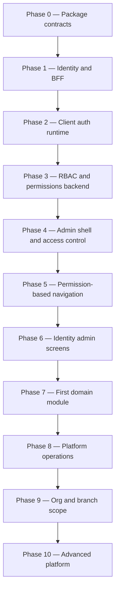

# Enterprise Admin — Implementation Roadmap

**Status:** Planning document (pre-implementation)  
**Date:** 2026-07-22  
**Audience:** Engineering leads, platform architects, implementers  
**Prerequisite docs:** [Authentication Architecture](../authentication-architecture.md) · [Authentication Foundation](../authentication-foundation.md) · [Enterprise Admin Architecture](./enterprise-admin-architecture.md)

---

## Purpose

This roadmap defines **implementation phases** for the Enterprise Admin Framework, ordered by **architectural dependency**. Security foundation (authentication, session, RBAC, permissions, access control) comes first. Advanced capabilities (multi-tenancy, module registry, plugins, workflows, ABAC) are explicitly deferred until the foundation is proven in production paths.

**This is not a time estimate.** Phases complete when exit criteria are met, not by calendar.

---

## Guiding principles

| Principle                            | Implication                                                                                                          |
| ------------------------------------ | -------------------------------------------------------------------------------------------------------------------- |
| **Security before features**         | No domain modules until auth + RBAC gates work end-to-end                                                            |
| **Backend enforcement is mandatory** | UI permission checks are UX only; bootstrap + API guards are authoritative                                           |
| **Ports before adapters**            | Implement `@enterprise/session`, `@enterprise/auth`, `@enterprise/permissions` contracts before IdP/vendor specifics |
| **Admin dogfoods first**             | Admin app is the primary proving ground for RBAC; dashboard and landing follow                                       |
| **Defer advanced scope**             | Single organization initially; multi-tenant, ABAC, plugins, and workflows come later                                 |
| **No architecture rewrites**         | Each phase extends the OIDC + BFF + session envelope model documented in ADRs                                        |

---

## Current state (baseline)

| Area                                          | Status                                          |
| --------------------------------------------- | ----------------------------------------------- |
| `@enterprise/ui`                              | Production-ready design system                  |
| `@enterprise/auth`                            | Stub ports (`AuthBoundary` only)                |
| `@enterprise/permissions`                     | Stub ports (`PermissionChecker` interface only) |
| `@enterprise/session`, `@enterprise/identity` | Not created                                     |
| `apps/frontend/admin`                         | Provider stub only — no Vite shell, no routes   |
| `apps/frontend/dashboard`                     | Provider stub only                              |
| `apps/frontend/landing`                       | Production-ready — reference for data flow      |
| `apps/backend`                                | Placeholder — no Platform API                   |

---

## Phase dependency overview

| Deferred to Phase 10+            | Why deferred                                                 |
| -------------------------------- | ------------------------------------------------------------ |
| Multi-tenant provisioning        | Requires proven single-org authz first                       |
| Module registry / plugins        | Needs stable permission + navigation pipeline                |
| Feature flags admin              | Depends on session bootstrap maturity                        |
| Approval workflows               | Depends on permissions + audit                               |
| ABAC policy engine               | Extension of RBAC — not a starting point                     |
| SAML / enterprise IdP federation | OIDC path must work first (Keycloak dev is enough initially) |

---

## Phase 0 — Session and auth contracts

### Goal

Establish shared **types and contracts** so BFF, client, backend, and tests speak the same language before any OIDC or UI work begins.

### Main tasks

| Task                                          | Detail                                                                                                           |
| --------------------------------------------- | ---------------------------------------------------------------------------------------------------------------- |
| Create `@enterprise/session`                  | `SessionEnvelope`, scope types, Zod schemas, bootstrap request/response types, anonymous/expired shapes          |
| Expand `@enterprise/auth` (contracts entry)   | `AuthClient` port, `AUTH_ROUTES` constants, BFF response types, `LoginOptions`, deprecated `AuthBoundary` bridge |
| Expand `@enterprise/permissions` (types only) | Permission string types, `PermissionPolicy`, route meta types — no runtime checker yet                           |
| Configure package entry points                | `exports` map for `@enterprise/auth`, `/client`, `/react`, `/bff` (stubs acceptable)                             |
| ESLint boundary rules                         | Block `@enterprise/auth/bff` and `@enterprise/identity` from client globs                                        |
| Update package READMEs                        | Document only what exists; remove fictional API claims                                                           |
| Add `enterprise.config.ts` schema (spec)      | Auth driver, issuer, bootstrap URL — documentation + Zod schema, no runtime yet                                  |

### Affected apps / packages

| Create or modify                                                                  |
| --------------------------------------------------------------------------------- |
| **New:** `packages/session`                                                       |
| **Modify:** `packages/auth`, `packages/permissions`, `packages/types` (if needed) |
| **Modify:** `tooling/eslint-config/boundaries.mjs`, `tsconfig.base.json` paths    |
| **Docs:** align with [Authentication Foundation](../authentication-foundation.md) |

### Expected outcome

- All packages compile and pass boundary lint
- `SessionEnvelope` is importable from backend, BFF, and client code
- No OIDC, no login UI, no admin shell yet
- Teams can mock sessions in tests using typed envelopes

**Exit criteria:** Typecheck green; boundary validation passes; contract packages published internally via workspace.

---

## Phase 1 — Identity provider and BFF foundation

### Goal

Prove **OIDC Authorization Code + PKCE** and **per-app BFF** on one application (Landing first), with tokens never exposed to the browser.

### Main tasks

| Task                          | Detail                                                                                      |
| ----------------------------- | ------------------------------------------------------------------------------------------- |
| Create `@enterprise/identity` | `IdentityProviderAdapter` port, OIDC discovery, PKCE helpers, `KeycloakAdapter` (dev)       |
| Create `@enterprise/auth/bff` | Login/callback/session/logout handler factories, OAuth state + PKCE storage, cookie helpers |
| Landing BFF wiring            | Next.js Route Handlers: `/auth/login`, `/auth/callback`, `/auth/session`, `/auth/logout`    |
| Session store (dev)           | In-memory or Redis for BFF sessions; encrypted token fields                                 |
| Platform API stub             | `GET /v1/session/bootstrap` returning minimal envelope (user + empty permissions)           |
| Keycloak (Docker)             | Dev realm, `landing-app` OIDC client, test users                                            |
| JWT validation stub           | Platform API validates access token via JWKS (can be middleware-only initially)             |

### Affected apps / packages

| Create or modify                                                                            |
| ------------------------------------------------------------------------------------------- |
| **New:** `packages/identity`                                                                |
| **Modify:** `packages/auth` (`/bff` entry), `apps/frontend/landing/app/auth/`               |
| **New:** `apps/backend/` minimal service (or landing Route Handler proxy to mock bootstrap) |
| **Infra:** Keycloak docker-compose for local dev                                            |

### Expected outcome

- User can log in on Landing via IdP redirect
- BFF sets httpOnly session cookie; browser receives `SessionEnvelope` without tokens
- `/auth/session` returns authenticated or anonymous typed envelope
- Logout clears Landing session
- Pattern documented and repeatable for Dashboard/Admin

**Exit criteria:** Manual SSO test on Landing passes; security review confirms no tokens in client bundle.

---

## Phase 2 — Client auth runtime and multi-app BFF

### Goal

Complete the **client-side auth stack** and replicate the BFF pattern on **Dashboard** and **Admin** origins for cross-domain SSO.

### Main tasks

| Task                             | Detail                                                                    |
| -------------------------------- | ------------------------------------------------------------------------- |
| Create `@enterprise/auth/client` | `createAuthClient()`, session fetch, login/logout redirects               |
| Create `@enterprise/auth/react`  | `AuthProvider`, `useAuth()`, `useRequireAuth()`, session polling on focus |
| Dashboard BFF                    | Node server (or Vite plugin server) with same `/auth/*` contract          |
| Admin BFF                        | Same as dashboard — separate OIDC client (`admin-app`)                    |
| Register OIDC clients            | Keycloak clients for dashboard + admin redirect URIs                      |
| Cross-domain SSO test            | Login on Landing → open Admin without re-entering credentials             |
| Refresh token rotation           | BFF refresh with reuse detection (minimum viable)                         |
| SSR session helper               | Landing RSC reads session via `@enterprise/auth/client` server helper     |

### Affected apps / packages

| Create or modify                                                              |
| ----------------------------------------------------------------------------- |
| **Modify:** `packages/auth` (`/client`, `/react`)                             |
| **Modify:** `apps/frontend/dashboard` (Vite shell bootstrap + `server/auth/`) |
| **Modify:** `apps/frontend/admin` (Vite shell bootstrap + `server/auth/`)     |
| **Modify:** `apps/frontend/landing` (wire `AuthProvider` where needed)        |

### Expected outcome

- All three apps share identical BFF route contract and session envelope shape
- SSO works across independent origins via IdP session
- React apps boot, call `/auth/session`, and redirect unauthenticated users to login
- Dashboard and Admin have minimal Vite entry points (no RBAC UI yet)

**Exit criteria:** Cross-app SSO demonstrated; refresh rotation documented; client lint confirms no `/bff` or `identity` imports in client bundles.

---

## Phase 3 — RBAC, permissions model, and backend bootstrap

### Goal

Make **authorization authoritative** — roles and permissions resolved server-side and delivered via bootstrap; implement the **PermissionChecker** runtime.

### Main tasks

| Task                                         | Detail                                                                                    |
| -------------------------------------------- | ----------------------------------------------------------------------------------------- |
| Permission catalog                           | Seed platform permissions using naming convention (`orders.view`, `users.manage`, etc.)   |
| Role templates                               | Default roles (org admin, branch manager, viewer) as permission bundles — **labels only** |
| Platform API: roles CRUD                     | Backend endpoints for roles (admin-only later; API first)                                 |
| Platform API: user ↔ role assignment        | Map users to roles for single organization                                                |
| Bootstrap enrichment                         | `/session/bootstrap` returns `roles`, `permissions[]`, `organization` (single org)        |
| Implement `createPermissionChecker(session)` | `@enterprise/permissions` runtime using envelope permissions                              |
| API route guards                             | Backend middleware: `requirePermission('resource.action')`                                |
| BFF API proxy (admin)                        | `/api/*` proxy attaching access token; backend validates permissions                      |
| Ban role-name checks                         | ESLint rule or codemod policy: no `user.role ===` in features                             |

### Affected apps / packages

| Create or modify                                                                     |
| ------------------------------------------------------------------------------------ |
| **Modify:** `packages/permissions` (runtime + optional `/react` stubs)               |
| **Modify:** `packages/session` (bootstrap response fields)                           |
| **Modify:** `apps/backend/` (auth middleware, bootstrap, roles, permissions storage) |
| **Modify:** `apps/frontend/admin` BFF (bootstrap + `/api` proxy)                     |
| **Data:** DB schema for users, roles, role_permissions, user_roles (single org)      |

### Expected outcome

- Session envelope includes real `permissions` array from backend
- `PermissionChecker.can('orders.view')` works in unit tests with mock envelopes
- Backend returns `403` when permission missing — independent of UI
- Role changes reflect on next bootstrap refresh (within TTL)

**Exit criteria:** Two users with different roles receive different permission sets from bootstrap; API denies unauthorized mutations.

---

## Phase 4 — Admin shell and access control

### Goal

Deliver a **minimal admin application** where every route and sensitive UI element is gated by permissions — the security foundation usable by feature teams.

### Main tasks

| Task                        | Detail                                                                                            |
| --------------------------- | ------------------------------------------------------------------------------------------------- |
| Admin Vite app shell        | Router, layout chrome, `@enterprise/ui` + `DesignSystemProvider`                                  |
| Wire `AuthProvider`         | Admin bootstrap providers; session on app load                                                    |
| Route guards                | React Router loaders/meta using `requiredPermissions` + `PermissionChecker`                       |
| `PermissionGate` component  | `@enterprise/permissions/react` — hide or disable actions                                         |
| Protected pages             | Dashboard home (`dashboard.view`), settings stub (`settings.organization.view`), forbidden `/403` |
| Login/logout UX             | Redirect flows via BFF; authenticated shell renders                                               |
| Unauthorized UX             | 403 page, tooltip on disabled actions (`@enterprise/ui` Tooltip pattern)                          |
| Admin BFF bootstrap profile | Full envelope: org + permissions (branch nullable initially)                                      |
| Composition root            | `apps/frontend/admin/src/bootstrap/` wiring ports                                                 |

### Affected apps / packages

| Create or modify                                                                           |
| ------------------------------------------------------------------------------------------ |
| **Modify:** `apps/frontend/admin` (shell, bootstrap, routes, features/platform)            |
| **Modify:** `packages/permissions/react` (`PermissionGate`, `usePermission`)               |
| **Modify:** `packages/ui` (only if shell needs layout primitives — prefer composite reuse) |
| **Modify:** `apps/backend` (admin-specific bootstrap profile)                              |

### Expected outcome

- Admin app loads only for authenticated users
- Routes without permission redirect to `/403` or hide from router registration
- Buttons/actions wrapped in `PermissionGate` demonstrate pattern for all future features
- No domain modules (orders, inventory) required yet

**Exit criteria:** User with `viewer` role sees subset of routes vs `org-admin`; direct URL to forbidden route returns 403; backend agrees with UI.

---

## Phase 5 — Permission-based navigation

### Goal

Replace hardcoded menus with **navigation generated from permissions** — still without a plugin module registry.

### Main tasks

| Task                            | Detail                                                                           |
| ------------------------------- | -------------------------------------------------------------------------------- |
| Navigation manifest (static)    | Typed tree of nav nodes with `permissions[]` per node — config file in admin app |
| Nav filter pipeline             | Filter manifest by `PermissionChecker` + session                                 |
| Sidebar / header                | Admin shell renders filtered tree                                                |
| Command palette stub (optional) | Same filtered nodes                                                              |
| Parent visibility rule          | Show parent only if ≥1 child visible                                             |
| i18n labels                     | Nav labels via `@enterprise/i18n` namespaces                                     |
| Dashboard nav (subset)          | Reuse same manifest pattern with fewer nodes                                     |

### Affected apps / packages

| Create or modify                                                                    |
| ----------------------------------------------------------------------------------- |
| **Modify:** `apps/frontend/admin/src/shell/navigation/`                             |
| **Modify:** `apps/frontend/admin/src/config/navigation.ts`                          |
| **Modify:** `packages/permissions` (nav filter helper accepting manifest + checker) |
| **Optional:** `apps/frontend/dashboard` shell nav                                   |

### Expected outcome

- Sidebar items appear/disappear based on permissions, not role names
- Adding a new nav item requires manifest entry + permission seed — not router hacks
- Foundation ready for future dynamic module-contributed nav (Phase 10)

**Exit criteria:** Changing user permissions changes sidebar without code deploy; deep links still guarded by route permissions.

---

## Phase 6 — Identity administration screens

### Goal

Admin users can **manage users, roles, and permission assignments** through the UI — completing the RBAC loop.

### Main tasks

| Task                            | Detail                                                                  |
| ------------------------------- | ----------------------------------------------------------------------- |
| Users list + invite             | `users.view`, `users.invite`; repository + application layers per ADR   |
| User detail                     | View roles, status; `users.update` gated actions                        |
| Roles list + create             | `roles.view`, `roles.create`                                            |
| Role editor                     | Assign permissions from catalog; `roles.assign`                         |
| Permission catalog read-only UI | `permissions.view` — reference for admins                               |
| Audit hooks (minimal)           | Log role assignment changes (console or DB append — full audit Phase 8) |
| DataTable integration           | `@enterprise/ui` DataTable for lists                                    |

### Affected apps / packages

| Create or modify                                                         |
| ------------------------------------------------------------------------ |
| **Modify:** `apps/frontend/admin/src/features/users/`, `features/roles/` |
| **Modify:** `apps/frontend/admin/src/repositories/`, `application/`      |
| **Modify:** `apps/backend/` (users, roles, assignments API)              |
| **Modify:** navigation manifest (Users, Roles sections)                  |

### Expected outcome

- Org admin can invite user and assign role
- New user's next login bootstrap reflects assigned permissions
- All screens respect permission gates on actions (create, assign, archive)

**Exit criteria:** Role assignment in UI → bootstrap change → nav and route access update after refresh.

---

## Phase 7 — First domain module (reference)

### Goal

Prove the **feature + repository + permission** pattern with one domain module (restaurant **Orders** sample) without introducing plugin architecture.

### Main tasks

| Task                    | Detail                                                    |
| ----------------------- | --------------------------------------------------------- |
| Orders permissions seed | `orders.view`, `orders.create`, `orders.cancel`, etc.     |
| Orders routes           | List + detail pages behind permissions                    |
| Repository layer        | `orders.repository` + API datasource                      |
| Application use cases   | List orders, cancel order (permission-gated)              |
| Nav manifest entries    | Orders section filtered by `orders.view`                  |
| Backend orders API      | Scope to single org; permission middleware on every route |

### Affected apps / packages

| Create or modify                                                                                          |
| --------------------------------------------------------------------------------------------------------- |
| **Modify:** `apps/frontend/admin/src/features/orders/` (or `modules/orders/` if folder convention chosen) |
| **Modify:** `apps/backend/` orders domain                                                                 |
| **Modify:** permission catalog + role templates                                                           |

### Expected outcome

- End-to-end domain feature with authz at route, action, and API layers
- Template for CRM, inventory, HR modules later
- Validates ADR data flow inside authenticated admin

**Exit criteria:** Cashier role sees orders but cannot cancel; manager can; API returns 403 on bypass attempts.

---

## Phase 8 — Platform operations (audit, notifications, settings)

### Goal

Add **cross-cutting admin capabilities** that depend on stable auth and permissions but precede multi-tenancy and plugins.

### Main tasks

| Task                   | Detail                                                               |
| ---------------------- | -------------------------------------------------------------------- |
| Audit log API          | Append-only events for auth and role changes                         |
| Audit viewer UI        | `audit-logs.view`, filtered list                                     |
| Notifications (in-app) | `notifications.view`; scoped inbox from bootstrap                    |
| Settings framework     | Layered settings schema (org + user); `settings.organization.update` |
| User profile           | `/profile` self-service (theme, language) — distinct from user admin |
| Session management UI  | View/revoke own sessions (`sessions.view-self`)                      |
| Back-channel logout    | All BFFs implement IdP back-channel endpoint                         |
| Global logout          | RP-initiated logout across apps                                      |

### Affected apps / packages

| Create or modify                                                                                 |
| ------------------------------------------------------------------------------------------------ |
| **Modify:** `apps/frontend/admin/src/features/audit/`, `notifications/`, `settings/`, `profile/` |
| **Modify:** `apps/backend/` audit + notifications services                                       |
| **Modify:** all app BFFs (back-channel logout)                                                   |
| **Optional:** `packages/logger` integration for structured audit events                          |

### Expected outcome

- Security-sensitive actions leave audit trail
- Admins see notifications and org settings
- Logout propagates across Landing, Dashboard, Admin

**Exit criteria:** Role change appears in audit log; global logout clears all app sessions in test environment.

---

## Phase 9 — Organization and branch scope

### Goal

Extend authorization with **operational scope** (branch) while remaining **single-tenant** — preparing for SaaS without full multi-tenant provisioning yet.

### Main tasks

| Task                      | Detail                                                           |
| ------------------------- | ---------------------------------------------------------------- |
| Branch model (backend)    | Branches under single organization                               |
| User ↔ branch assignment | Users scoped to one or more branches                             |
| Active branch in session  | Branch switcher in admin header; bootstrap accepts `X-Branch-Id` |
| Data scoping middleware   | API filters by active branch                                     |
| Branch permissions        | `branches.view`, `branches.switch-context`                       |
| Org admin cross-branch    | Elevated permission to view all branches                         |
| Dashboard branch context  | If applicable to end-user app                                    |

### Affected apps / packages

| Create or modify                                                  |
| ----------------------------------------------------------------- |
| **Modify:** `packages/session` (branch scope enforcement helpers) |
| **Modify:** `apps/backend/` branch APIs + query scoping           |
| **Modify:** `apps/frontend/admin/src/shell/branch-switcher/`      |
| **Modify:** bootstrap + BFF scope headers                         |

### Expected outcome

- Branch manager sees only their branch data in orders module
- Org admin can switch branch or view all
- Session envelope reflects active branch

**Exit criteria:** Same user, different branch selection → different data scope; API enforces branch filter.

---

## Phase 10 — Advanced platform (deferred)

### Goal

Add SaaS-scale and extensibility features **only after Phases 0–9 are stable in production**.

### Main tasks (grouped — implement sub-phases when evidence demands)

| Track               | Tasks                                                                       |
| ------------------- | --------------------------------------------------------------------------- |
| **Multi-tenancy**   | Tenant provisioning, tenant resolver, per-tenant IdP config, data isolation |
| **Module registry** | `ModuleManifest`, enable/disable modules per org, dynamic nav contributions |
| **Feature flags**   | `@enterprise/feature-flags` runtime wired to bootstrap; admin UI for flags  |
| **Plugin SDK**      | `definePlugin()`, third-party module package, route merger                  |
| **Workflows**       | Approval engine (refunds, leave, cancellations)                             |
| **ABAC**            | Contextual policies extending RBAC                                          |
| **Enterprise IdP**  | SAML federation via Keycloak/Azure AD; Auth0/Okta adapter parity            |
| **CLI / templates** | `create-enterprise-app`, admin template extraction                          |

### Affected apps / packages

| Scope                                                                                             |
| ------------------------------------------------------------------------------------------------- |
| Entire platform — new packages only when [FUTURE-PLAN](../FUTURE-PLAN.md) evidence thresholds met |

### Expected outcome

- Platform evolves to full Enterprise Admin Architecture vision without rewriting auth foundation
- Each track ships independently behind feature flags

**Exit criteria:** Defined per sub-track when scheduled.

---

## Summary matrix

| Phase  | Focus                       | Primary apps                    | Primary packages                 |
| ------ | --------------------------- | ------------------------------- | -------------------------------- |
| **0**  | Contracts                   | —                               | `session`, `auth`, `permissions` |
| **1**  | OIDC + BFF                  | `landing`                       | `identity`, `auth/bff`           |
| **2**  | Client auth + SSO           | `landing`, `dashboard`, `admin` | `auth/client`, `auth/react`      |
| **3**  | RBAC backend                | `backend`, `admin` BFF          | `permissions`, `session`         |
| **4**  | Access control UI           | `admin`                         | `permissions/react`, `ui`        |
| **5**  | Navigation                  | `admin`, `dashboard`            | `permissions`                    |
| **6**  | Users & roles admin         | `admin`, `backend`              | —                                |
| **7**  | Domain sample               | `admin`, `backend`              | —                                |
| **8**  | Audit, notifications        | `admin`, `backend`, all BFFs    | `logger`                         |
| **9**  | Branch scope                | `admin`, `backend`              | `session`                        |
| **10** | Multi-tenant, plugins, ABAC | platform-wide                   | `feature-flags`, plugin SDK      |

---

## Parallel work constraints

| May run in parallel                          | Must stay sequential                                               |
| -------------------------------------------- | ------------------------------------------------------------------ |
| Phase 0 package work + Keycloak docker setup | Phase 3 before Phase 4 (permissions before admin gates)            |
| Backend API design while Phase 1 BFF builds  | Phase 1 before Phase 2 (BFF before client assumes `/auth/session`) |
| UI shell mockups (static) during Phase 2     | Phase 4 before Phase 7 (access control before domain modules)      |
| Documentation updates                        | Phase 2 before Phase 3 cross-app (SSO before RBAC matrix testing)  |

**Maximum parallelization after Phase 3:** Backend team extends API; frontend team builds shell (Phase 4–5) while backend completes users/roles API (Phase 6).

---

## Risk register (by phase)

| Phase | Risk                              | Mitigation                                               |
| ----- | --------------------------------- | -------------------------------------------------------- |
| 0     | README/API fiction persists       | README audit gate before Phase 1 merge                   |
| 1     | Next.js BFF complexity            | Landing first; extract patterns to `auth/bff`            |
| 2     | Three BFF deployments             | Shared handler factories; identical route contract tests |
| 3     | Permissions drift UI vs API       | Single catalog source; bootstrap is authoritative        |
| 4     | `role === admin` shortcuts        | Lint ban; code review checklist                          |
| 7     | Domain logic before auth patterns | Phase 4 exit criteria mandatory                          |
| 9     | Scope leaks                       | API integration tests per branch                         |

---

## Related documents

| Document                                                            | Use when                                 |
| ------------------------------------------------------------------- | ---------------------------------------- |
| [Authentication Architecture](../authentication-architecture.md)    | OIDC + BFF decisions                     |
| [Authentication Foundation](../authentication-foundation.md)        | Package entry points, session model      |
| [Enterprise Admin Architecture](./enterprise-admin-architecture.md) | RBAC, permissions naming, future modules |
| [FUTURE-PLAN](../FUTURE-PLAN.md)                                    | Long-term platform vision                |
| [Architecture ADRs](../architecture/README.md)                      | Feature folders, repository pattern      |

## Document history

| Version | Date       | Changes                                            |
| ------- | ---------- | -------------------------------------------------- |
| 1.0     | 2026-07-22 | Initial phased roadmap — security foundation first |
