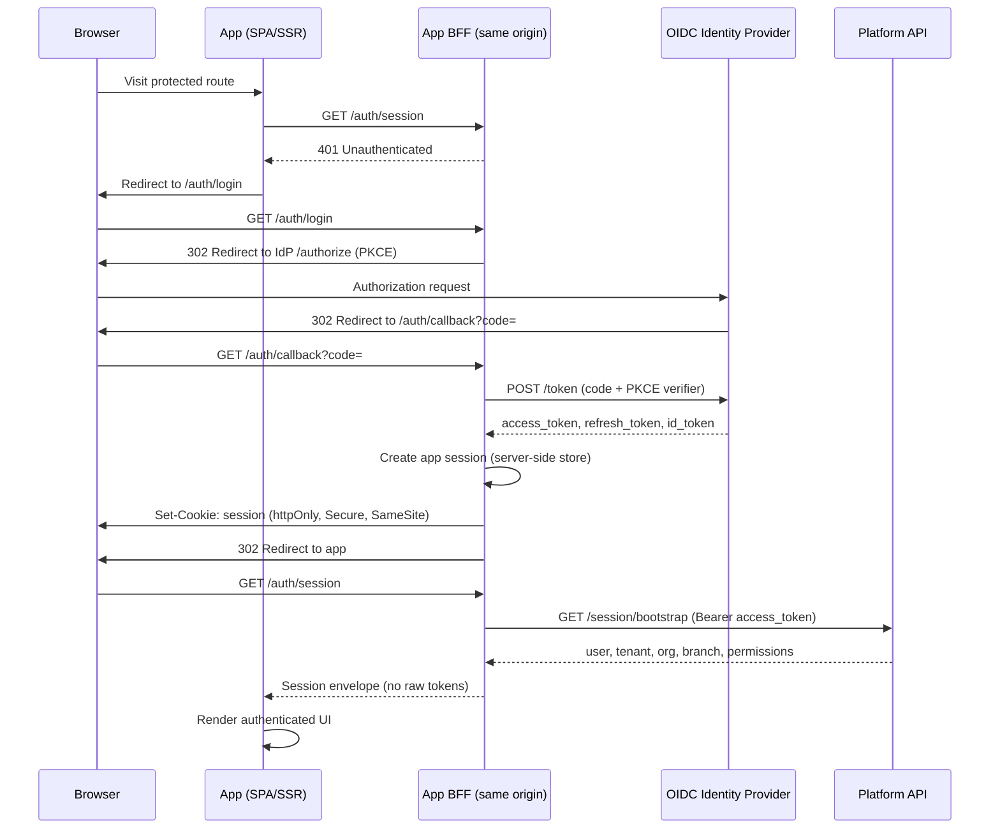
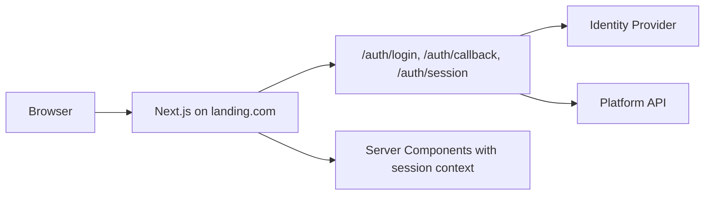
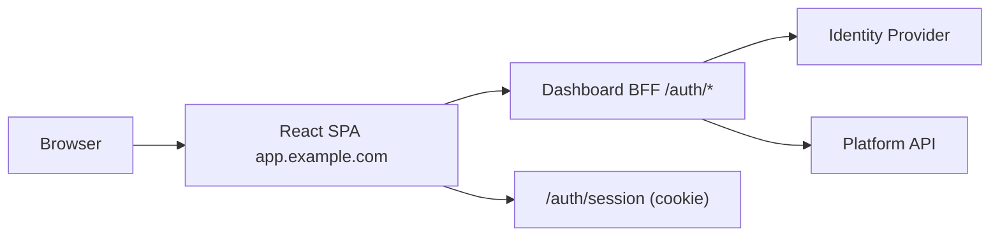
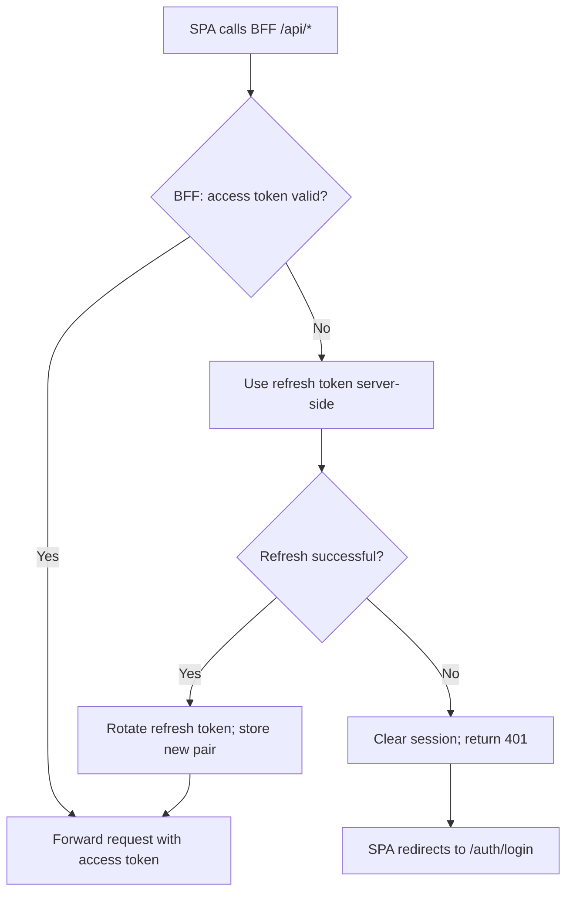
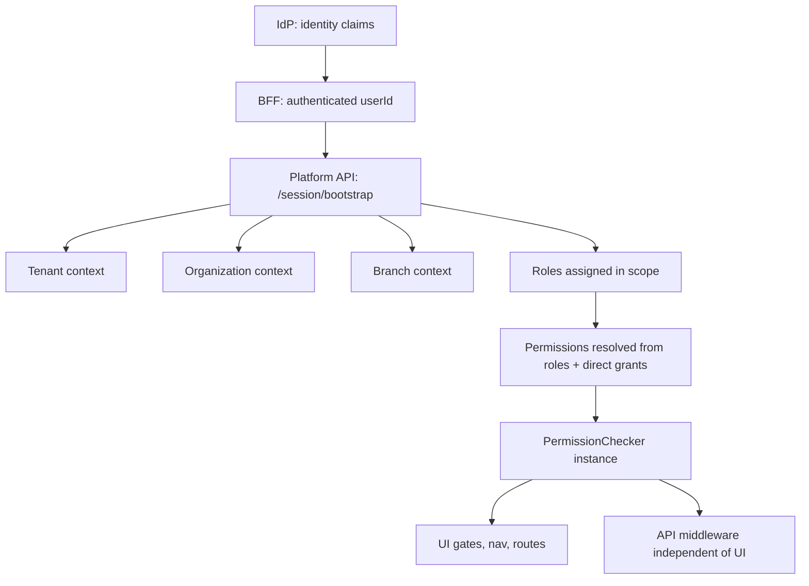
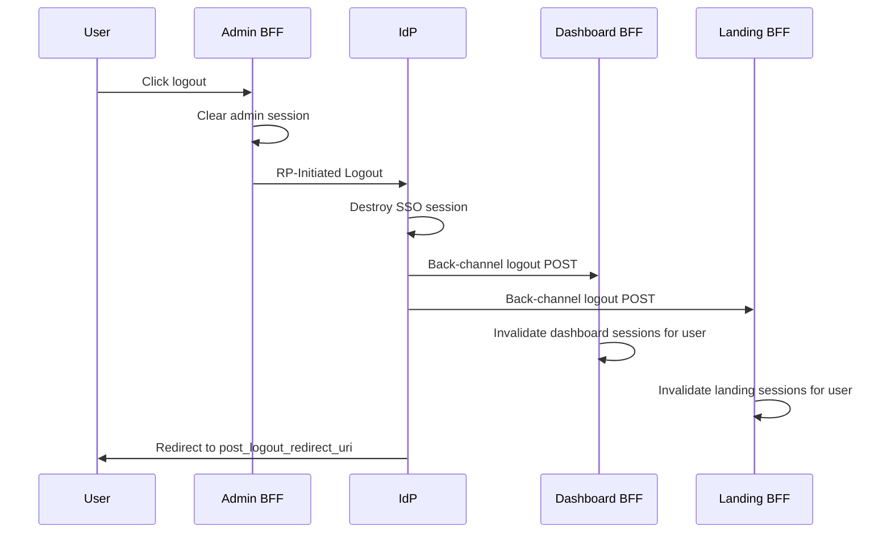

# Authentication Architecture

**Status:** Proposed Architecture Decision Record (ADR)  
**Date:** 2026-07-22  
**Audience:** Platform architects, security reviewers, senior engineers  
**Scope:** Cross-application authentication for Landing (Next.js SSR), Dashboard (Vite CSR), and Admin (Vite CSR)  
**Related:** [Admin architecture](./admin/enterprise-admin-architecture.md) · [FUTURE-PLAN.md](./FUTURE-PLAN.md) · [packages.md](./packages.md)

---

## Executive summary

### Decision

Adopt **OpenID Connect (OIDC) Authorization Code Flow with PKCE**, backed by an **external OIDC Identity Provider**, with a **per-application Backend-for-Frontend (BFF)** on each app origin.

| Layer                | Choice                                         | Rationale                                                                                            |
| -------------------- | ---------------------------------------------- | ---------------------------------------------------------------------------------------------------- |
| Protocol             | **OIDC** (on OAuth 2.0)                        | Industry standard; supported by Keycloak, Auth0, Azure AD, Okta                                      |
| Identity             | **External OIDC provider** (pluggable)         | Enterprise SSO, SAML federation, reduced security liability                                          |
| App integration      | **Per-app BFF**                                | Secure token handling across **independent domains** without shared cookies or browser token storage |
| Authorization (RBAC) | **Platform-owned** (`@enterprise/permissions`) | Business permissions, tenant/org/branch scope stay in platform API — not in IdP roles alone          |
| Frontend contract    | **`AuthProvider` port**                        | Apps never import vendor SDKs; swap IdP without rewrites                                             |

### Answer to the core question

> How can one user authenticate once and securely access multiple independent applications hosted on different domains?

**Via a centralized IdP SSO session**, not via shared application cookies.

1. User authenticates once at the **Identity Provider** (e.g. `auth.example.com`).
2. The IdP sets its **own session cookie** on the IdP domain.
3. Each application (`landing.com`, `app.customer.com`, `admin.company.com`) runs an independent **BFF** on its own origin.
4. When an app needs authentication, the browser is redirected to the IdP. If the IdP session is valid, the user is authenticated **without re-entering credentials** (SSO).
5. Each BFF completes the OIDC code exchange **server-side**, stores refresh tokens securely, and maintains an **app-local session** (httpOnly cookie on that app's domain only).
6. Applications never rely on cross-domain cookies, `localStorage` tokens, or a shared auth cookie.

```text
                 Identity Provider (OIDC)
              Keycloak / Auth0 / Azure AD / Okta
                           |
         SSO session cookie (IdP domain only)
                           |
        -----------------------------------------
        |                  |                  |
   Landing BFF        Dashboard BFF       Admin BFF
   (Next.js SSR)      (Vite + Node)       (Vite + Node)
   landing.com        app.example.com     admin.example.com
        |                  |                  |
   Next.js app         React SPA           React SPA
```

---

## Table of contents

1. [Context and requirements](#1-context-and-requirements)
2. [Identity provider architecture (external vs internal)](#2-identity-provider-architecture-external-vs-internal)
3. [Protocol and provider comparison](#3-protocol-and-provider-comparison)
4. [Recommended authentication flows](#4-recommended-authentication-flows)
5. [Cross-domain SSO](#5-cross-domain-sso)
6. [Token and session strategy](#6-token-and-session-strategy)
7. [Architecture comparison: SPA PKCE vs BFF vs hybrid](#7-architecture-comparison-spa-pkce-vs-bff-vs-hybrid)
8. [Monorepo package architecture](#8-monorepo-package-architecture)
9. [Authorization boundary](#9-authorization-boundary)
10. [Logout propagation](#10-logout-propagation)
11. [Multi-domain deployment scenarios](#11-multi-domain-deployment-scenarios)
12. [Security model](#12-security-model)
13. [Future Keycloak and enterprise IdP compatibility](#13-future-keycloak-and-enterprise-idp-compatibility)
14. [Migration path](#14-migration-path)
15. [Future scalability](#15-future-scalability)
16. [Final recommendation](#16-final-recommendation)

---

## 1. Context and requirements

### Applications

| App           | Stack                | Rendering       | Auth need                                                                |
| ------------- | -------------------- | --------------- | ------------------------------------------------------------------------ |
| **Landing**   | Next.js (App Router) | SSR / SSG / RSC | Mostly public; optional authenticated areas (account, orders, favorites) |
| **Dashboard** | React + Vite         | CSR SPA         | Authenticated end-users                                                  |
| **Admin**     | React + Vite         | CSR SPA         | Authenticated enterprise users with RBAC                                 |

### Requirements

| Requirement                   | Implication                                                        |
| ----------------------------- | ------------------------------------------------------------------ |
| Single Sign-On across apps    | Central IdP session; not shared app cookies                        |
| One user account              | Single identity record at IdP; same `sub` claim everywhere         |
| Persistent login              | Refresh token rotation via BFF; IdP SSO session for silent re-auth |
| Secure token management       | Tokens never exposed to browser JavaScript                         |
| RBAC + permission-based authz | Identity at IdP; authorization at platform API                     |
| Multi-tenant / org / branch   | Session bootstrap from platform API after authentication           |
| Enterprise customers          | SAML/OIDC federation, on-prem IdP, compliance                      |
| Multi-domain                  | Each app origin has its own BFF and session cookie                 |
| Provider portability          | Standard OIDC; no vendor SDK in feature code                       |

### Hard constraints (this ADR)

| Do NOT assume                                | Why                                                             |
| -------------------------------------------- | --------------------------------------------------------------- |
| Shared browser cookies across apps           | Apps may live on unrelated domains                              |
| Domain-wide cookies (`.example.com`)         | Option 2 and SaaS white-label break this                        |
| `localStorage` / `sessionStorage` for tokens | XSS exfiltration; fails enterprise security review              |
| Frontend-only OAuth                          | Refresh tokens and client secrets cannot be secured in pure CSR |

### Current monorepo state

| Package                   | Status                                                           |
| ------------------------- | ---------------------------------------------------------------- |
| `@enterprise/auth`        | Port stubs (`AuthBoundary`, token types) — no `AuthProvider` yet |
| `@enterprise/permissions` | Port stubs (`PermissionChecker`)                                 |
| `@enterprise/api-client`  | Fetch client with auth middleware hooks                          |
| Backend                   | Not started (`apps/backend/` placeholder)                        |

This document defines the **target architecture** before implementation.

---

## 2. Identity provider architecture (external vs internal)

### Option A — Managed externally (recommended)

Authentication is delegated to an **OIDC-compliant Identity Provider**.

```text
Browser → App BFF → OIDC Provider → (optional) Enterprise IdP (SAML)
                         ↓
                  Platform API (authorization)
```

| Advantages                                                            | Disadvantages                                                 |
| --------------------------------------------------------------------- | ------------------------------------------------------------- |
| OIDC/OAuth standards; portable across Keycloak, Auth0, Azure AD, Okta | Recurring cost (managed) or ops burden (self-hosted Keycloak) |
| Enterprise SSO (SAML federation) via IdP                              | Less control over login UI unless customized                  |
| MFA, brute-force protection, anomaly detection out of the box         | Vendor or infra dependency                                    |
| Security patches handled by IdP vendor or dedicated team              | Data residency depends on IdP deployment                      |
| Front-channel and back-channel logout standards                       | Custom claims/scopes require IdP configuration                |
| Proven cross-domain SSO via IdP session cookie                        |                                                               |

### Option B — Built internally (custom auth service)

Platform implements credential verification, MFA, token issuance, and session store.

| Advantages                              | Disadvantages                                                    |
| --------------------------------------- | ---------------------------------------------------------------- |
| Full control over UX and data residency | High security liability (passwords, MFA, token crypto)           |
| No per-MAU vendor fees at scale         | Must still implement OIDC endpoints for SSO and federation       |
| Custom tenant provisioning              | Enterprise customers expect SAML/OIDC — you rebuild IdP features |
|                                         | SOC2/ISO audit scope expands dramatically                        |
|                                         | Slower time to market                                            |
|                                         | Becomes a second product to maintain                             |

### Recommendation

**Option A — External OIDC provider**, with a **platform-owned authorization layer**.

| Concern                            | Owner                                    |
| ---------------------------------- | ---------------------------------------- |
| Identity (who is the user?)        | OIDC Identity Provider                   |
| Authentication (proof of identity) | OIDC Identity Provider                   |
| Authorization (what can they do?)  | Platform API + `@enterprise/permissions` |
| Tenant / org / branch scope        | Platform API session bootstrap           |
| Business RBAC                      | Platform database + policy engine        |

A custom auth service is **not recommended** as the primary identity system. If needed later, implement it as an **OIDC-compatible provider** (e.g. Keycloak realm or custom IdP behind standard endpoints) — not as ad-hoc JWT endpoints consumed directly by SPAs.

### Phased IdP selection

| Phase       | IdP                                                    | When                             |
| ----------- | ------------------------------------------------------ | -------------------------------- |
| Development | Keycloak (Docker) or Auth0 dev tenant                  | Immediate — free, OIDC-compliant |
| SaaS launch | Auth0 or Clerk **via OIDC adapter** (not embedded SDK) | Speed to market                  |
| Enterprise  | Keycloak (self-hosted) or Azure AD / Okta              | Customer SSO, on-prem, SAML      |

The **BFF + OIDC port architecture** is identical regardless of which IdP is configured in `enterprise.config.ts`.

---

## 3. Protocol and provider comparison

### Protocol level

| Technology                | What it is                                                          | Fit for this monorepo                                             |
| ------------------------- | ------------------------------------------------------------------- | ----------------------------------------------------------------- |
| **OAuth 2.0**             | Authorization framework (delegated access)                          | Foundation only — insufficient alone for identity                 |
| **OpenID Connect (OIDC)** | Identity layer on OAuth 2.0 (`id_token`, UserInfo, standard scopes) | **Recommended protocol**                                          |
| **SAML 2.0**              | Enterprise federation (XML, browser POST)                           | Supported **through** IdP (Keycloak/Azure AD bridge to OIDC apps) |

**Decision:** Use **OIDC Authorization Code Flow with PKCE** for all browser-based applications.

### Provider comparison

| Criteria                          | Keycloak                                   | Auth0                        | Clerk                                    | Custom             |
| --------------------------------- | ------------------------------------------ | ---------------------------- | ---------------------------------------- | ------------------ |
| **Protocol**                      | OIDC, OAuth 2.0, SAML                      | OIDC, OAuth 2.0, SAML        | OIDC (proprietary SDK if used directly)  | Whatever you build |
| **Enterprise SSO**                | Excellent (SAML, LDAP, broker)             | Excellent                    | Moderate                                 | Must build         |
| **Self-hosted / on-prem**         | Yes                                        | No (Private Cloud option)    | No                                       | Yes                |
| **Multi-tenant SaaS**             | Realms / organizations                     | Organizations, Actions       | Organizations                            | Custom             |
| **Cross-domain SSO**              | IdP session cookie                         | Universal Login session      | Session via Clerk domain                 | Custom             |
| **BFF compatibility**             | Excellent (standard OIDC)                  | Excellent                    | Good if using OIDC mode, not React SDK   | Custom             |
| **SSR (Next.js)**                 | Standard OIDC middleware                   | Standard OIDC middleware     | SDK-centric — avoid in features          | Custom             |
| **CSR (Vite SPA)**                | BFF + OIDC redirect                        | BFF + OIDC redirect          | BFF + OIDC redirect                      | Custom             |
| **RBAC for business permissions** | Keycloak Authorization Services (optional) | Auth0 RBAC (limited)         | Basic roles                              | Full control       |
| **Vendor lock-in risk**           | Low (self-host, standard OIDC)             | Low if OIDC-only integration | **High** if using `@clerk/*` SDK in apps | None               |
| **Ops burden**                    | High (self-host)                           | Low                          | Low                                      | Very high          |
| **Cost at scale**                 | Infra only                                 | Per MAU                      | Per MAU                                  | Engineering time   |
| **Azure AD / Okta parity**        | Comparable for self-host enterprises       | Comparable                   | Weaker for enterprise                    | N/A                |

### Advantages and disadvantages summary

#### OAuth 2.0 (alone)

| Pros                             | Cons                                  |
| -------------------------------- | ------------------------------------- |
| Industry standard for delegation | No standardized identity claims       |
| PKCE for public clients          | Not sufficient for SSO identity layer |

**Verdict:** Use as transport; not the architecture label.

#### OpenID Connect (OIDC)

| Pros                                               | Cons                                                 |
| -------------------------------------------------- | ---------------------------------------------------- |
| Standard identity claims (`sub`, `email`, `name`)  | Requires correct implementation (nonce, state, PKCE) |
| Authorization Code + PKCE is browser best practice | Misconfiguration leads to vulnerabilities            |
| Supported by all enterprise IdPs                   |                                                      |
| Enables true cross-domain SSO via IdP session      |                                                      |
| Works with BFF pattern                             |                                                      |

**Verdict:** **Selected protocol.**

#### Keycloak

| Pros                                             | Cons                                           |
| ------------------------------------------------ | ---------------------------------------------- |
| Open source; self-hosted; full OIDC/SAML         | Operational complexity (HA, upgrades, backups) |
| Identity brokering (Google, Azure AD, SAML)      | UI theming requires effort                     |
| Multi-tenant via realms                          | Team needs Keycloak expertise                  |
| Authorization Services for policy (optional)     |                                                |
| No per-user licensing                            |                                                |
| Best long-term enterprise path for this platform |                                                |

**Verdict:** **Recommended for enterprise / self-host trajectory.**

#### Auth0

| Pros                                | Cons                             |
| ----------------------------------- | -------------------------------- |
| Fast setup; managed; excellent OIDC | Cost at scale                    |
| Enterprise SAML/OIDC federation     | Less control over infrastructure |
| Actions/Rules for claims enrichment |                                  |
| Strong BFF + OIDC documentation     |                                  |

**Verdict:** **Recommended for SaaS launch velocity** (via OIDC adapter, not SPA SDK).

#### Clerk

| Pros                        | Cons                                                    |
| --------------------------- | ------------------------------------------------------- |
| Excellent DX for React      | SDK-first design conflicts with port-based architecture |
| Fastest initial integration | Cross-domain SSO requires Clerk-hosted session          |
| Pre-built UI components     | Enterprise SAML less mature than Auth0/Keycloak         |
|                             | **High lock-in** if SDK used in features                |

**Verdict:** Acceptable **only via OIDC federation**, not as embedded SDK. Not recommended as primary long-term enterprise IdP.

#### Custom authentication

| Pros           | Cons                                         |
| -------------- | -------------------------------------------- |
| Total control  | Security, compliance, and maintenance burden |
| No vendor fees | Must implement OIDC endpoints anyway for SSO |
|                | Enterprise sales blocker without SAML/OIDC   |
|                | Diverts engineering from core product        |

**Verdict:** **Not recommended** as primary approach. Platform team should build **authorization**, not an identity provider.

---

## 4. Recommended authentication flows

### Shared pattern (all apps)

Every application follows the same OIDC + BFF contract:



### Landing (Next.js SSR)

Next.js Route Handlers **are** the Landing BFF — no separate Node server required.

```text
Browser
  → Next.js Server (Route Handlers: /auth/*)
    → OIDC Identity Provider
    → Platform API (/session/bootstrap)
  → RSC / SSR pages (session from server)
```



| Concern            | Approach                                                                      |
| ------------------ | ----------------------------------------------------------------------------- |
| SSR session access | Server reads httpOnly session cookie in Route Handlers / middleware           |
| RSC auth           | `getServerSession()` calls BFF session resolver — never reads browser storage |
| Public pages       | No session cookie required; optional auth enriches UI                         |
| API routes         | BFF attaches access token to Platform API calls server-side                   |

### Dashboard (React + Vite CSR)

Vite SPA cannot securely hold OIDC secrets. A **co-located BFF** (Node/Express, Hono, or nginx + small Node service) serves the same `/auth/*` endpoints on the dashboard origin.

```text
Browser
  → React SPA on app.example.com
  → Dashboard BFF on app.example.com/auth/*
    → Identity Provider
    → Platform API
```



| Concern          | Approach                                                                                        |
| ---------------- | ----------------------------------------------------------------------------------------------- |
| Route protection | SPA calls `/auth/session` on load; redirect to `/auth/login` if 401                             |
| API calls        | Browser calls BFF proxy (`/api/*`) or Platform API through BFF — access token added server-side |
| TanStack Query   | Session context from `/auth/session`, not from tokens                                           |

### Admin (React + Vite CSR)

Identical to Dashboard BFF pattern. Admin BFF additionally returns **permission-enriched session** from Platform API bootstrap.

```text
Browser
  → React SPA on admin.example.com
  → Admin BFF on admin.example.com/auth/*
    → Identity Provider
    → Platform API (bootstrap with RBAC)
```

Admin session envelope includes `permissions`, `roles`, `organizationId`, `branchId` — sourced from Platform API, not from IdP JWT claims alone.

---

## 5. Cross-domain SSO

### Problem

Applications may live on **different domains**:

| Scenario          | Example                                                        |
| ----------------- | -------------------------------------------------------------- |
| Subdomains        | `www.example.com`, `app.example.com`, `admin.example.com`      |
| Unrelated domains | `landing-company.com`, `customer-app.com`, `admin-company.com` |
| SaaS white-label  | `portal.customer-a.com`, `portal.customer-b.com`               |

Each origin is a **separate browser cookie jar**. Authentication cannot rely on sharing cookies between apps.

### Solution: IdP-centric SSO

SSO state lives on the **Identity Provider domain** (e.g. `auth.example.com`), not on application domains.

```mermaid
sequenceDiagram
  participant U as User
  participant L as landing.com
  participant LB as Landing BFF
  participant I as auth.example.com (IdP)
  participant A as admin.com
  participant AB as Admin BFF

  U->>L: Visit landing.com/account
  L->>LB: Login flow
  LB->>I: OIDC authorize (PKCE)
  U->>I: Enter credentials (first login)
  I->>I: Create IdP SSO session cookie
  I->>LB: Authorization code
  LB->>LB: Exchange code; set landing.com session cookie
  LB->>U: Authenticated on landing.com

  Note over U,I: Later — user opens admin.com

  U->>A: Visit admin.com
  A->>AB: GET /auth/session → 401
  A->>AB: GET /auth/login
  AB->>I: OIDC authorize (PKCE, prompt=none or login)
  I->>I: IdP SSO cookie valid — skip login form
  I->>AB: Authorization code (no credential prompt)
  AB->>AB: Exchange code; set admin.com session cookie
  AB->>U: Authenticated on admin.com (SSO)
```

### Step-by-step: landing.com → admin.com without re-login

| Step                               | What happens                                                                                                                                              |
| ---------------------------------- | --------------------------------------------------------------------------------------------------------------------------------------------------------- |
| 1. **Browser redirect**            | Admin SPA redirects to `admin.com/auth/login`                                                                                                             |
| 2. **BFF builds authorize URL**    | Admin BFF redirects browser to `auth.example.com/authorize?client_id=admin-app&redirect_uri=https://admin.com/auth/callback&code_challenge=...&state=...` |
| 3. **IdP session check**           | IdP finds existing SSO session cookie from earlier landing login                                                                                          |
| 4. **Authorization code issued**   | IdP redirects to `admin.com/auth/callback?code=...&state=...` without credential prompt                                                                   |
| 5. **Code exchange (server-side)** | Admin BFF POSTs to IdP `/token` with `code_verifier` — receives tokens                                                                                    |
| 6. **App session created**         | Admin BFF stores refresh token server-side; sets httpOnly session cookie on `admin.com`                                                                   |
| 7. **Bootstrap**                   | Admin BFF calls Platform API with access token; returns permissions to SPA                                                                                |

### IdP session handling

| Mechanism                     | Purpose                                                         |
| ----------------------------- | --------------------------------------------------------------- |
| IdP SSO cookie                | Single sign-on across all OIDC clients                          |
| `prompt=none` silent auth     | Check SSO without UI (handle `login_required` error)            |
| `max_age`                     | Force re-authentication for sensitive admin actions             |
| Separate OIDC clients per app | Each BFF has its own `client_id` and redirect URI on its domain |
| Shared IdP realm / tenant     | Same user pool across all apps                                  |

### Token issuance per app

Each app BFF receives **its own tokens** from the IdP (per OIDC client). Tokens are **not shared** between apps. SSO avoids re-entering credentials — not sharing refresh tokens across domains.

---

## 6. Token and session strategy

### Principle

**Do not store OAuth/OIDC tokens in browser JavaScript storage.** Tokens are managed by each app's BFF. The browser holds only an **opaque app-session cookie** per origin.

### Token lifecycle

| Token                  | Lifetime               | Stored where                                | Used where                |
| ---------------------- | ---------------------- | ------------------------------------------- | ------------------------- |
| **Authorization code** | ~60 seconds            | URL (transient)                             | BFF exchanges immediately |
| **Access token**       | Short (5–15 min)       | BFF server memory / encrypted session store | BFF → Platform API        |
| **Refresh token**      | Long (days–weeks)      | BFF server-side store only                  | BFF token refresh         |
| **ID token**           | Short                  | BFF server-side (validation only)           | Identity claims at login  |
| **App session ID**     | Matches refresh policy | httpOnly cookie on app domain               | Browser → BFF             |

### Refresh token strategy



| Rule                | Detail                                                          |
| ------------------- | --------------------------------------------------------------- |
| **Rotation**        | Issue new refresh token on each use; invalidate previous        |
| **Reuse detection** | If rotated token reused, revoke entire session family           |
| **Binding**         | Bind refresh token to BFF session ID + client_id                |
| **Storage**         | Encrypted server-side store (Redis, PostgreSQL) — never browser |
| **Scope**           | Refresh token scoped to app's OIDC client                       |

### Session database requirement

**Yes — required.** Each BFF maintains a server-side session store.

| Store                  | Contents                                                                                          |
| ---------------------- | ------------------------------------------------------------------------------------------------- |
| Session ID (in cookie) | Opaque random identifier                                                                          |
| Server record          | `userId`, `accessToken`, `refreshToken`, `expiresAt`, `idTokenClaims`, `pkceVerifier` (transient) |

Recommended: **Redis** for session store (fast, TTL) with **PostgreSQL** for audit and refresh token family tracking.

Landing (Next.js) may use encrypted cookies (e.g. iron-session) for smaller deployments, but Redis remains recommended for production parity across apps.

### CSRF protection

| Layer         | Mechanism                                                                            |
| ------------- | ------------------------------------------------------------------------------------ |
| BFF mutations | `SameSite=Lax` or `Strict` session cookie + CSRF token for state-changing BFF routes |
| OIDC callback | `state` parameter validation                                                         |
| PKCE          | Prevents authorization code interception                                             |
| Platform API  | Bearer token from BFF only — browser never holds Bearer token                        |

### JWT usage

| Use JWT? | Where                         | Why                                      |
| -------- | ----------------------------- | ---------------------------------------- |
| Yes      | Access token from IdP         | Standard OIDC; short-lived               |
| Yes      | ID token                      | Identity claims at authentication time   |
| Optional | Platform-issued session token | Internal only; BFF validates server-side |
| No       | Long-lived JWT in browser     | Cannot revoke quickly; XSS risk          |

Platform API validates IdP access tokens via **JWKS introspection** or **token introspection endpoint**. Permissions are **not** embedded in JWT access tokens — they come from the bootstrap API (see [§9](#9-authorization-boundary)).

---

## 7. Architecture comparison: SPA PKCE vs BFF vs hybrid

### Option 1 — Pure SPA OAuth with PKCE

```text
Browser (SPA) → IdP redirect → Browser stores tokens in memory/localStorage
SPA → Platform API (Bearer token in Authorization header)
```

| Pros                               | Cons                                                                            |
| ---------------------------------- | ------------------------------------------------------------------------------- |
| Simple deployment (static hosting) | Refresh token in browser is security risk                                       |
| No BFF server                      | Fails enterprise security review                                                |
|                                    | PKCE alone does not secure refresh tokens in SPA                                |
|                                    | Cross-domain SSO still needs IdP session, but token storage remains problematic |
|                                    | No server-side session revocation control                                       |
|                                    | Incompatible with httpOnly cookie requirement                                   |

**Verdict:** **Rejected** for admin and dashboard. Unacceptable for enterprise SaaS.

### Option 2 — BFF architecture (recommended)

```text
Browser → App BFF (same origin, httpOnly cookie) → IdP + Platform API
Browser → SPA (no tokens)
```

| Pros                               | Cons                           |
| ---------------------------------- | ------------------------------ |
| Tokens never in browser            | Requires server per app origin |
| httpOnly session cookies           | Slightly more infra            |
| Refresh token rotation server-side |                                |
| Works across independent domains   |                                |
| SSR and CSR use same auth contract |                                |
| Enterprise security standard       |                                |
| Compatible with all OIDC providers |                                |

**Verdict:** **Selected.**

### Option 3 — Hybrid SSR + CSR

```text
Landing: Next.js BFF (Route Handlers)
Dashboard/Admin: Node BFF co-located with Vite
All: Same OIDC contract, same session envelope shape
```

| Pros                                                                        | Cons                                                   |
| --------------------------------------------------------------------------- | ------------------------------------------------------ |
| Next.js uses native Route Handlers — no extra server for landing            | Two BFF implementations (Next handlers vs Node server) |
| Shared `@enterprise/auth` and `@enterprise/session` packages unify contract | Must keep session shape identical                      |
| Optimal SSR auth on landing                                                 |                                                        |

**Verdict:** **Selected** — hybrid BFF with **shared auth packages**, not hybrid token storage.

### Comparison table

| Criteria               | Pure SPA PKCE    | BFF                           | Hybrid BFF    |
| ---------------------- | ---------------- | ----------------------------- | ------------- |
| Multi-domain SSO       | IdP session only | **IdP session + per-app BFF** | **Same**      |
| Token in browser       | Yes (problem)    | **No**                        | **No**        |
| SSR compatibility      | Poor             | Good                          | **Excellent** |
| CSR compatibility      | Good             | **Excellent**                 | **Excellent** |
| Enterprise readiness   | Low              | **High**                      | **High**      |
| Keycloak/Azure AD/Okta | Yes              | **Yes**                       | **Yes**       |
| Refresh token security | Weak             | **Strong**                    | **Strong**    |
| Monorepo fit           | Poor             | Good                          | **Best**      |

**Final choice:** Hybrid BFF (Option 2 + 3) — per-app BFF with shared `@enterprise/auth` / `@enterprise/session` contracts.

---

## 8. Monorepo package architecture

### Recommended packages

```text
packages/
  identity/       # OIDC protocol port + IdP adapters
  auth/           # AuthProvider port (app-facing authentication API)
  session/        # Session envelope types + bootstrap contract
  permissions/    # PermissionChecker port (existing)
  api-client/     # HTTP client with BFF proxy mode (existing)
```

### Package responsibilities

| Package                       | Responsibility                                          | Key exports (target)                                                                         |
| ----------------------------- | ------------------------------------------------------- | -------------------------------------------------------------------------------------------- |
| **`@enterprise/identity`**    | OIDC protocol abstraction; IdP adapter interfaces       | `OidcClient`, `IdentityProviderAdapter`, `KeycloakAdapter`, `Auth0Adapter`, `AzureAdAdapter` |
| **`@enterprise/auth`**        | App-facing authentication port — login, logout, session | `AuthProvider`, `requireAuth()`, `login()`, `logout()`, extends current `AuthBoundary`       |
| **`@enterprise/session`**     | Session shape shared by all apps and Platform API       | `SessionEnvelope`, `BootstrapSession`, `TenantScope`, `BranchScope`                          |
| **`@enterprise/permissions`** | Authorization checker (existing)                        | `PermissionChecker`, `PermissionPolicy`                                                      |
| **`@enterprise/api-client`**  | HTTP to Platform API via BFF proxy                      | `createApiClient({ baseUrl: '/api' })` — tokens injected by BFF, not client                  |

### Dependency graph

```mermaid
graph TD
  apps[Apps: landing, dashboard, admin] --> auth[@enterprise/auth]
  apps --> session[@enterprise/session]
  apps --> permissions[@enterprise/permissions]
  auth --> identity[@enterprise/identity]
  auth --> session
  auth --> api-client[@enterprise/api-client]
  permissions --> session
  identity --> types[@enterprise/types]
  session --> types
  auth --> types
```

### What each layer must NOT do

| Package       | Must NOT                                                                                |
| ------------- | --------------------------------------------------------------------------------------- |
| `identity`    | Contain business RBAC logic or UI                                                       |
| `auth`        | Import `@clerk/nextjs`, `@auth0/nextjs-auth0` in public API — adapters live behind port |
| `session`     | Store tokens — only typed envelopes                                                     |
| `permissions` | Perform authentication or parse JWTs                                                    |
| Features / UI | Import any IdP vendor SDK                                                               |

### BFF implementation location (apps, not packages)

| App       | BFF location                                                          |
| --------- | --------------------------------------------------------------------- |
| Landing   | `apps/frontend/landing/app/auth/[...path]/route.ts`                   |
| Dashboard | `apps/frontend/dashboard/server/` or standalone `apps/bff/dashboard/` |
| Admin     | `apps/frontend/admin/server/` or standalone `apps/bff/admin/`         |

BFF code uses `@enterprise/identity` adapters. It is **deployed per origin**, not published as a shared npm package initially.

### `enterprise.config.ts` (target)

```typescript
// Documentation only — not implemented
export default defineConfig({
  identity: {
    provider: 'oidc', // 'oidc' | 'keycloak' | 'auth0' | 'azure-ad'
    issuer: 'https://auth.example.com/realms/acme',
    clientId: 'landing-app', // per-app override at deploy time
    clientSecret: env.OIDC_CLIENT_SECRET, // BFF only — never client bundle
    scopes: ['openid', 'profile', 'email'],
  },
  session: {
    bootstrapUrl: 'https://api.example.com/v1/session/bootstrap',
    cookieName: '__Host-app-session',
    maxAge: 604800,
  },
});
```

---

## 9. Authorization boundary

Authentication and authorization are **separate systems** joined at session bootstrap.

```text
┌─────────────────────────────────────────────────────────┐
│                    OIDC Identity Provider               │
│  Answers: Who is the user? (sub, email, email_verified) │
└───────────────────────────┬─────────────────────────────┘
                            │ access_token
                            ▼
┌─────────────────────────────────────────────────────────┐
│                     Platform API                        │
│  Answers: What can they do? Where? (RBAC + scope)       │
│  Returns: roles, permissions, tenant, org, branch       │
└───────────────────────────┬─────────────────────────────┘
                            │ SessionEnvelope
                            ▼
┌─────────────────────────────────────────────────────────┐
│              App BFF + SPA (all applications)           │
│  Uses: PermissionChecker.can('orders.create')          │
└─────────────────────────────────────────────────────────┘
```

### Flow: User → Roles → Permissions → Scope



| Layer            | Source                       | Example                           |
| ---------------- | ---------------------------- | --------------------------------- |
| **Identity**     | IdP (`sub`, `email`)         | `user-123`                        |
| **Tenant**       | Platform DB                  | `tenant-acme`                     |
| **Organization** | Platform DB                  | `org-restaurants-llc`             |
| **Branch**       | Platform DB (user selection) | `branch-downtown`                 |
| **Roles**        | Platform DB                  | `branch-manager`                  |
| **Permissions**  | Platform policy engine       | `orders.cancel`, `inventory.view` |

### Why permissions are not in the IdP JWT

| Reason      | Detail                                            |
| ----------- | ------------------------------------------------- |
| Size        | Hundreds of permissions exceed JWT limits         |
| Freshness   | Role changes must apply without re-login          |
| Scope       | Branch-level permissions require platform context |
| Portability | Same authz model regardless of IdP vendor         |
| Audit       | Platform owns authorization audit trail           |

IdP roles (if any) should map to **coarse platform roles** at provisioning time — not replace the permission engine. See [Admin architecture §4](./admin/enterprise-admin-architecture.md#4-authorization-architecture).

### Session envelope (target)

```typescript
// @enterprise/session — documentation only
type SessionEnvelope = {
  user: {
    id: string;
    email: string;
    displayName: string;
    emailVerified: boolean;
  };
  tenant: { id: string; slug: string };
  organization: { id: string; name: string };
  branch: { id: string; name: string } | null;
  roles: readonly string[];
  permissions: readonly string[];
  expiresAt: string;
};
```

BFF returns this to SPAs. Raw OIDC tokens never leave the server.

---

## 10. Logout propagation

Logout has **three layers** that must all be addressed.

### Layer 1 — App session (per domain)

| Action                      | Detail                                                       |
| --------------------------- | ------------------------------------------------------------ |
| User clicks logout in Admin | Admin BFF deletes server session + clears `admin.com` cookie |
| Dashboard logout            | Dashboard BFF clears `app.example.com` cookie                |
| Landing logout              | Landing BFF clears `landing.com` cookie                      |

This alone does **not** log the user out of other apps or the IdP.

### Layer 2 — IdP SSO session (global)

Redirect browser to IdP **end session endpoint**:

```text
GET https://auth.example.com/logout
  ?client_id=admin-app
  &post_logout_redirect_uri=https://admin.com/
  &id_token_hint=...
```

IdP destroys SSO session cookie. Subsequent app login flows require credentials.

### Layer 3 — Cross-app notification

| Mechanism                | Standard                 | Use                                                             |
| ------------------------ | ------------------------ | --------------------------------------------------------------- |
| **Front-channel logout** | OIDC RP-Initiated Logout | Browser iframes/redirects to all registered logout URIs         |
| **Back-channel logout**  | OIDC Back-Channel Logout | IdP POSTs logout token to each BFF's `/auth/backchannel-logout` |
| **Session polling**      | Custom                   | SPAs poll `/auth/session` — fallback only                       |

**Recommended:** Implement **RP-Initiated Logout** + **Back-Channel Logout** on all BFFs.



### Logout propagation summary

| Scope        | Mechanism                 | Result                          |
| ------------ | ------------------------- | ------------------------------- |
| Current app  | BFF clears local session  | Immediate                       |
| All apps     | Back-channel logout       | All BFF sessions invalidated    |
| IdP SSO      | End session endpoint      | Re-login required on next visit |
| Platform API | Optional token revocation | Access tokens invalidated early |

---

## 11. Multi-domain deployment scenarios

### Scenario 1 — Subdomains (same registrable domain)

```text
www.example.com      → Landing BFF
app.example.com      → Dashboard BFF
admin.example.com    → Admin BFF
auth.example.com     → IdP
```

| Note                                          | Detail                                                         |
| --------------------------------------------- | -------------------------------------------------------------- |
| Cookies                                       | Still **per-origin** — `app.example.com` ≠ `admin.example.com` |
| SSO                                           | IdP session on `auth.example.com`                              |
| Do NOT rely on `.example.com` cookie for auth | Use IdP SSO, not shared app cookie                             |

### Scenario 2 — Unrelated domains

```text
landing-company.com  → Landing BFF
customer-app.com     → Dashboard BFF
admin-company.com    → Admin BFF
auth.example.com     → IdP (shared)
```

Same OIDC flow. Each app registered as separate OIDC client with exact redirect URI.

### Scenario 3 — SaaS white-label (customer domains)

```text
portal.customer-a.com  → Dashboard BFF (customer A)
portal.customer-b.com  → Dashboard BFF (customer B)
auth.platform.com      → IdP (multi-tenant realm)
```

| Approach                 | Detail                                                        |
| ------------------------ | ------------------------------------------------------------- |
| IdP tenant resolution    | Subdomain, `login_hint`, or branded login page per tenant     |
| OIDC clients             | Per-tenant or dynamic client registration                     |
| Platform bootstrap       | Tenant resolved from hostname or JWT `tenant_id` claim        |
| Same user across tenants | **No** — separate tenant isolation unless explicit federation |

---

## 12. Security model

### Authentication flow security

| Threat                          | Mitigation                                                              |
| ------------------------------- | ----------------------------------------------------------------------- |
| Authorization code interception | PKCE (S256)                                                             |
| CSRF on OAuth callback          | `state` parameter; validate in BFF                                      |
| Token exfiltration via XSS      | No tokens in JavaScript; httpOnly cookies                               |
| Session fixation                | New session ID after successful authentication                          |
| Replay                          | Short access token TTL; refresh rotation                                |
| IdP impersonation               | Validate JWT signature via JWKS; check `iss`, `aud`, `exp`, `nonce`     |
| Open redirect                   | Allowlist `redirect_uri` and `post_logout_redirect_uri` per OIDC client |

### SSR compatibility

| Concern                  | Solution                                                                           |
| ------------------------ | ---------------------------------------------------------------------------------- |
| Session in RSC           | Server reads httpOnly cookie via Next.js `cookies()` in Route Handler / middleware |
| Token refresh during SSR | BFF refreshes before rendering; never expose refresh to RSC props                  |
| Cache leakage            | Mark authenticated pages `dynamic = 'force-dynamic'` or equivalent                 |
| Session in props         | Pass `SessionEnvelope` — not tokens — to client components                         |

### CSR compatibility

| Concern            | Solution                                                      |
| ------------------ | ------------------------------------------------------------- |
| Initial auth check | `GET /auth/session` on app boot                               |
| API authorization  | All API calls via BFF proxy — BFF attaches access token       |
| 401 handling       | Redirect to `/auth/login` — never attempt client-side refresh |
| Permission gates   | `PermissionChecker` from session envelope                     |

### Compliance-oriented controls (future)

| Control           | Implementation                                                |
| ----------------- | ------------------------------------------------------------- |
| MFA               | Enforced at IdP (Keycloak/Auth0/Azure AD)                     |
| Step-up auth      | `acr` / `max_age` OIDC parameters for sensitive admin actions |
| Session recording | Platform audit log                                            |
| IP allowlisting   | BFF middleware + Platform API                                 |
| Data residency    | Self-hosted Keycloak + regional BFF deployment                |

---

## 13. Future Keycloak and enterprise IdP compatibility

### Design rule

Applications depend on **`@enterprise/identity` OIDC port** — never on vendor-specific APIs.

```typescript
// Documentation only
interface IdentityProviderAdapter {
  readonly name: string;
  buildAuthorizationUrl(options: AuthorizeOptions): string;
  exchangeCode(options: TokenExchangeOptions): Promise<OidcTokenSet>;
  refreshTokens(refreshToken: string): Promise<OidcTokenSet>;
  revokeToken(token: string): Promise<void>;
  buildLogoutUrl(options: LogoutOptions): string;
  validateIdToken(idToken: string): Promise<IdTokenClaims>;
  getJwksUri(): string;
}
```

### Provider mapping

| Provider                | Integration                                                          |
| ----------------------- | -------------------------------------------------------------------- |
| **Keycloak**            | `KeycloakAdapter` — self-hosted, full SAML brokering                 |
| **Auth0**               | `Auth0Adapter` — same OIDC endpoints                                 |
| **Azure AD**            | `AzureAdAdapter` — Microsoft identity platform v2                    |
| **Okta**                | `OktaAdapter` — standard OIDC                                        |
| **SAML enterprise IdP** | Federated **into** Keycloak/Azure AD; apps still use OIDC to gateway |

### SAML support path

Applications never implement SAML directly.

```text
Enterprise SAML IdP → Keycloak (or Azure AD) as broker → OIDC → App BFF
```

Adding SAML for enterprise customers is an **IdP configuration change**, not an application rewrite.

### Keycloak-specific features (optional, later)

| Feature                         | Use                                          |
| ------------------------------- | -------------------------------------------- |
| Keycloak Authorization Services | Supplement platform RBAC for coarse policies |
| Identity brokering              | Social login, customer SAML                  |
| User federation                 | LDAP/AD sync                                 |
| Realms                          | SaaS tenant isolation                        |

Platform business permissions remain in Platform API regardless.

---

## 14. Migration path

### Phase 0 — Documentation and ports (now)

- [x] Authentication architecture ADR (this document)
- [ ] Extend `@enterprise/auth` with `AuthProvider` port
- [ ] Add `@enterprise/identity` and `@enterprise/session` package stubs
- [ ] Align `@enterprise/permissions` with session envelope

### Phase 1 — Landing BFF prototype

| Step | Action                                                                             |
| ---- | ---------------------------------------------------------------------------------- |
| 1    | Deploy Keycloak (Docker) or Auth0 dev tenant                                       |
| 2    | Register `landing-app` OIDC client                                                 |
| 3    | Implement Next.js `/auth/login`, `/auth/callback`, `/auth/session`, `/auth/logout` |
| 4    | Mock Platform API `/session/bootstrap`                                             |
| 5    | Optional authenticated route on landing (account page)                             |

### Phase 2 — Dashboard and Admin BFF

| Step | Action                                                        |
| ---- | ------------------------------------------------------------- |
| 1    | Add Node BFF to dashboard and admin (same `/auth/*` contract) |
| 2    | Bootstrap Vite shells with session check on load              |
| 3    | Wire `@enterprise/api-client` through BFF proxy               |
| 4    | Implement permission gates in admin                           |

### Phase 3 — Platform API authorization

| Step | Action                                                            |
| ---- | ----------------------------------------------------------------- |
| 1    | Backend validates IdP JWT via JWKS                                |
| 2    | Implement `/session/bootstrap` with tenant/org/branch/permissions |
| 3    | Implement `PermissionChecker` runtime                             |
| 4    | Register OIDC clients for all apps in IdP                         |

### Phase 4 — Production hardening

| Step | Action                                   |
| ---- | ---------------------------------------- |
| 1    | Refresh token rotation + reuse detection |
| 2    | Back-channel logout on all BFFs          |
| 3    | Redis session store                      |
| 4    | MFA at IdP                               |
| 5    | Enterprise SAML via Keycloak broker      |

### Phase 5 — IdP swap validation

| Step | Action                                                  |
| ---- | ------------------------------------------------------- |
| 1    | Run full suite against Auth0 adapter                    |
| 2    | Run full suite against Keycloak adapter                 |
| 3    | Document `enterprise.config.ts` IdP switching procedure |

No application feature code changes required between Phase 5 adapter swaps.

---

## 15. Future scalability

| Dimension             | Strategy                                                                       |
| --------------------- | ------------------------------------------------------------------------------ |
| **Users**             | IdP handles identity scale; BFF stateless with Redis sessions                  |
| **Apps**              | Register new OIDC client + deploy new BFF — same packages                      |
| **Domains**           | New origin = new BFF deployment + IdP redirect URI allowlist                   |
| **Tenants**           | Platform bootstrap resolves tenant; IdP realm or custom claim                  |
| **Permissions**       | Platform policy engine; cache in session with short TTL + invalidation webhook |
| **Token validation**  | JWKS caching at Platform API; introspection fallback                           |
| **Global deployment** | Regional BFF + IdP replicas; sticky sessions or shared Redis                   |
| **White-label**       | Per-customer OIDC client + hostname-based tenant resolution                    |

### What scales independently

```text
Identity Provider     → authentication throughput, SSO sessions
App BFF (per origin)  → session count for that app domain
Platform API          → authorization, business data, audit
```

---

## 16. Final recommendation

### Selected architecture

| Decision                 | Choice                                                                                    |
| ------------------------ | ----------------------------------------------------------------------------------------- |
| **Protocol**             | OpenID Connect — Authorization Code Flow with PKCE                                        |
| **Identity provider**    | External OIDC (Keycloak for enterprise path; Auth0/Azure AD/Okta via same adapter)        |
| **App pattern**          | Per-application BFF on each origin (Hybrid: Next Route Handlers + Node BFF for Vite apps) |
| **SSO mechanism**        | Central IdP SSO session — not shared app cookies                                          |
| **Token storage**        | Server-side only in BFF; browser holds opaque httpOnly session cookie per app             |
| **Authorization**        | Platform-owned RBAC + permissions via `/session/bootstrap`                                |
| **Frontend integration** | `@enterprise/auth` AuthProvider port — no vendor SDKs in features                         |

### Rejected alternatives

| Alternative                               | Reason rejected                                                       |
| ----------------------------------------- | --------------------------------------------------------------------- |
| Pure SPA OAuth + PKCE with browser tokens | Insecure refresh handling; fails multi-domain enterprise requirements |
| Shared cookie across subdomains           | Breaks unrelated domains and white-label SaaS                         |
| localStorage session                      | XSS token theft                                                       |
| Custom auth without OIDC                  | Enterprise blocker; security liability                                |
| Clerk/Auth0 SDK in features               | Vendor lock-in; violates port architecture                            |
| Permissions in JWT                        | Stale, oversized, not scope-aware                                     |

### Comparison summary table

| Approach           | SSO cross-domain | SSR     | CSR     | Enterprise | IdP portable | Recommended  |
| ------------------ | ---------------- | ------- | ------- | ---------- | ------------ | ------------ |
| Pure SPA PKCE      | Partial          | Poor    | Good    | No         | Yes          | No           |
| BFF + OIDC         | **Yes**          | Good    | **Yes** | **Yes**    | **Yes**      | **Yes**      |
| Hybrid BFF         | **Yes**          | **Yes** | **Yes** | **Yes**    | **Yes**      | **Best fit** |
| Custom auth        | Custom           | Custom  | Custom  | No         | No           | No           |
| Clerk SDK embedded | Yes              | Good    | Good    | Moderate   | No           | No           |

### Implementation priority

1. Define ports: `@enterprise/identity`, `@enterprise/auth`, `@enterprise/session`
2. Implement Landing BFF (Next.js Route Handlers) against Keycloak dev instance
3. Implement Platform API bootstrap endpoint (mock → real)
4. Replicate BFF contract to Dashboard and Admin
5. Add back-channel logout and refresh rotation before production

---

## Appendix A — OIDC endpoints used by BFF

| Endpoint                            | Purpose                          |
| ----------------------------------- | -------------------------------- |
| `/.well-known/openid-configuration` | Discovery                        |
| `/authorize`                        | Browser redirect; PKCE challenge |
| `/token`                            | Code exchange and refresh        |
| `/userinfo`                         | Optional supplementary claims    |
| `/logout` or `/endsession`          | RP-initiated logout              |
| `/revoke`                           | Token revocation                 |
| `/certs` or JWKS URI                | JWT signature validation         |

## Appendix B — Related documents

| Document                                                                               | Topic                                 |
| -------------------------------------------------------------------------------------- | ------------------------------------- |
| [Admin enterprise architecture](./admin/enterprise-admin-architecture.md)              | RBAC, permissions, branch scope       |
| [FUTURE-PLAN.md](./FUTURE-PLAN.md)                                                     | Platform evolution, AuthProvider port |
| [packages.md](./packages.md)                                                           | Package dependency layers             |
| [ADR-004 Client/server boundaries](./architecture/ADR-004-client-server-boundaries.md) | Next.js provider boundaries           |

## Document history

| Version | Date       | Changes                                 |
| ------- | ---------- | --------------------------------------- |
| 1.0     | 2026-07-22 | Initial authentication architecture ADR |
