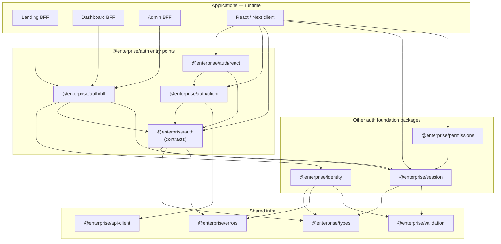
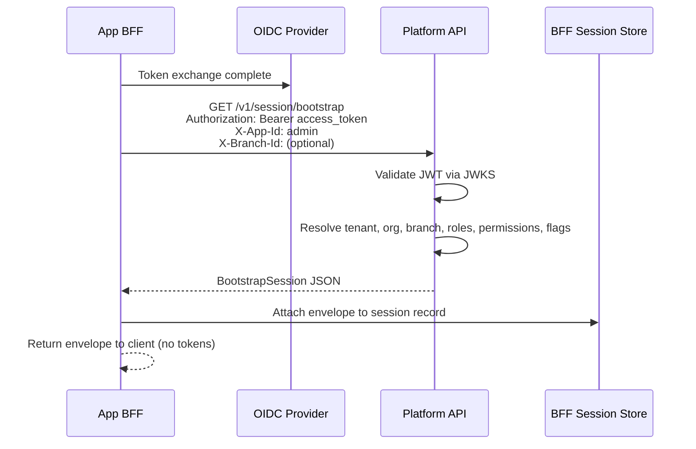
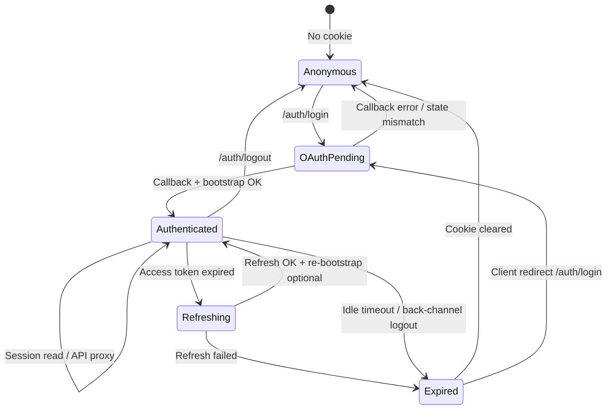
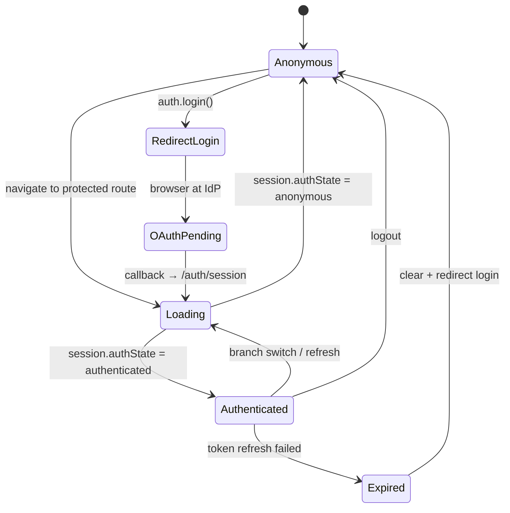
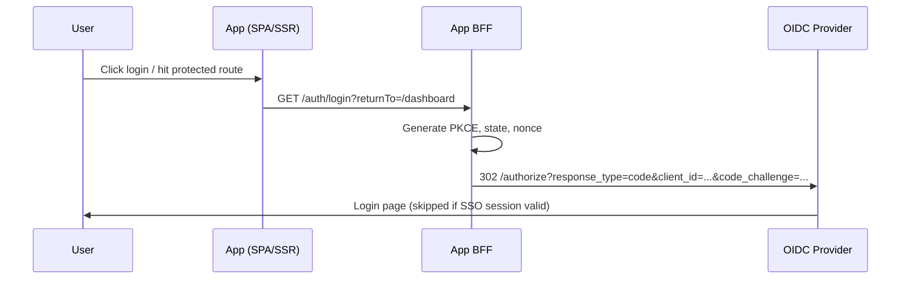
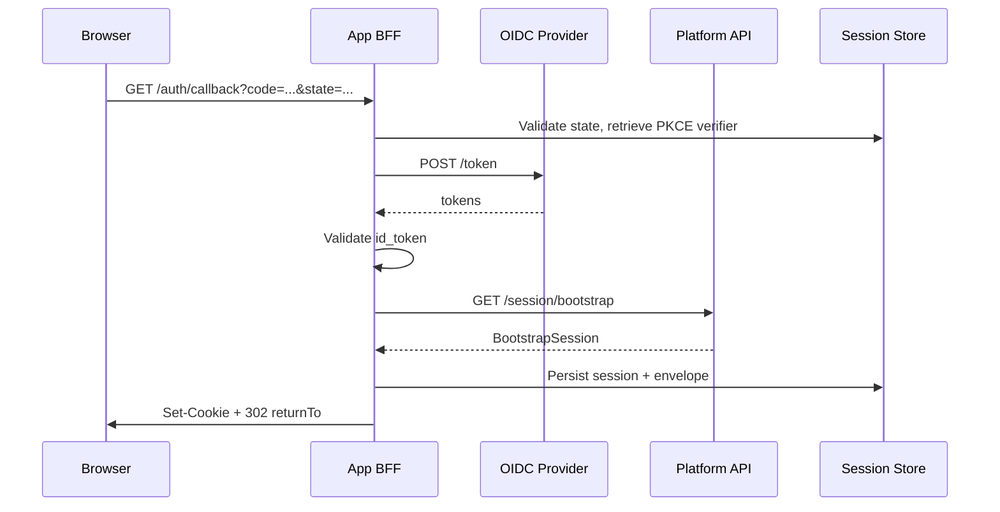
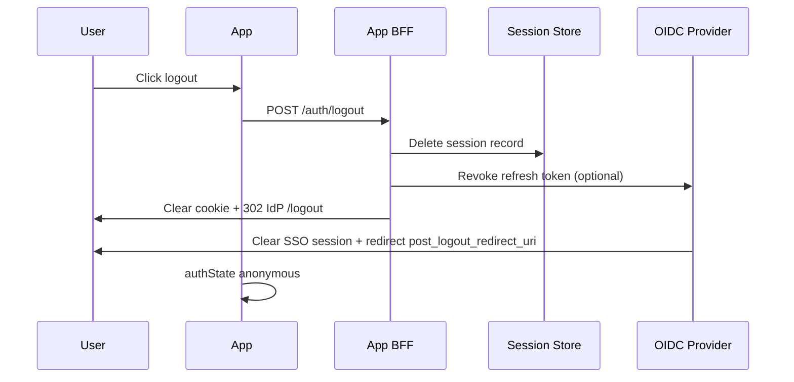
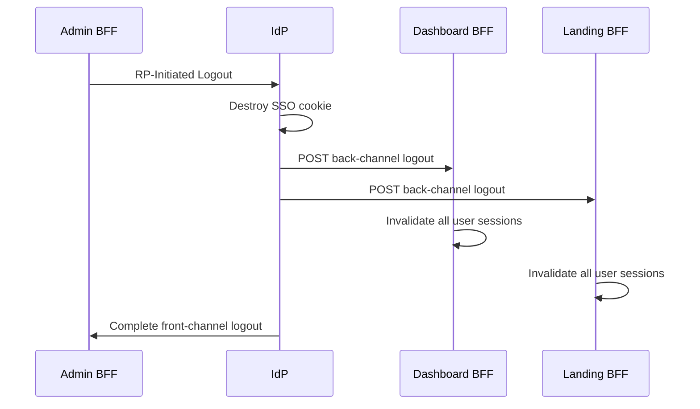
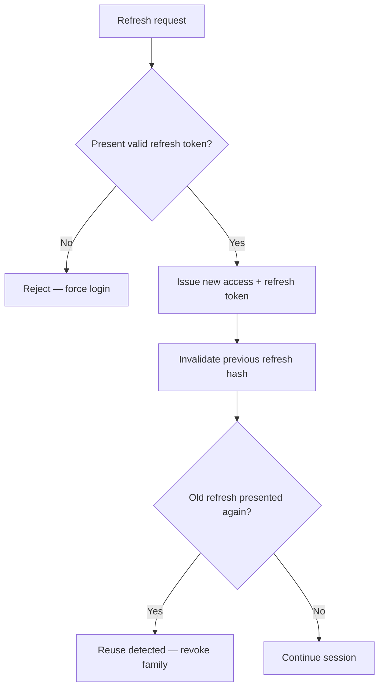

# Authentication Foundation — Implementation Design

**Status:** Implementation design (pre-code)  
**Date:** 2026-07-22  
**Audience:** Engineers implementing authentication foundation packages and BFF layers  
**Prerequisite:** [Authentication Architecture ADR](./authentication-architecture.md)  
**Related:** [Admin architecture](./admin/enterprise-admin-architecture.md) · [Module boundaries](./module-boundaries.md) · [packages.md](./packages.md)

---

## Revision history

| Version | Date       | Changes                                                                                                          |
| ------- | ---------- | ---------------------------------------------------------------------------------------------------------------- |
| 1.0     | 2026-07-22 | Initial implementation design                                                                                    |
| 1.1     | 2026-07-22 | **Refinement:** Split `@enterprise/auth` into contract, client, and BFF entry points to prevent dependency leaks |

---

## Purpose

This document translates the [Authentication Architecture ADR](./authentication-architecture.md) into an **implementation-ready design** for the authentication foundation. It defines package contracts, BFF behavior, session models, lifecycle states, monorepo boundaries, security rules, and IdP portability — **without writing code**.

When implementation begins, every file and module should trace back to a section in this document or the ADR.

---

## Table of contents

1. [Package architecture](#1-package-architecture)
2. [BFF architecture](#2-bff-architecture)
3. [Session model](#3-session-model)
4. [Application authentication lifecycle](#4-application-authentication-lifecycle)
5. [Monorepo boundaries](#5-monorepo-boundaries)
6. [Security model](#6-security-model)
7. [Future compatibility](#7-future-compatibility)

---

## 1. Package architecture

Four packages form the authentication foundation. **`@enterprise/auth` is split into three strict entry points** — contracts, client runtime, and BFF runtime — so browser bundles cannot accidentally import server-only code or OIDC adapters.

BFF route **implementations** live in applications. Packages define **contracts and reusable runtime helpers** only.

### 1.1 `@enterprise/auth` entry-point split (refinement)

**Problem:** A single `@enterprise/auth` package mixing client APIs, BFF route contracts, React bindings, and server helpers creates risk of accidental dependency leaks (e.g. client bundle pulling `@enterprise/identity` transitively, or BFF logic imported in features).

**Solution:** One npm package, **three isolated entry points** — mirroring `@enterprise/env/client` and `@enterprise/env/server`.

| Entry point        | Import path               | Platform tag       | Purpose                                              |
| ------------------ | ------------------------- | ------------------ | ---------------------------------------------------- |
| **Contracts**      | `@enterprise/auth`        | `platform:neutral` | Ports, types, BFF route constants — **zero runtime** |
| **Client runtime** | `@enterprise/auth/client` | `platform:web`     | BFF HTTP client, login/logout/session fetch          |
| **React bindings** | `@enterprise/auth/react`  | `platform:web`     | Context, hooks, route guards                         |
| **BFF runtime**    | `@enterprise/auth/bff`    | `platform:node`    | Route orchestration helpers, session store port      |

```text
@enterprise/auth              ← contracts ONLY (everyone may import)
@enterprise/auth/client       ← browser / SSR client fetch layer
@enterprise/auth/react        ← React provider + hooks
@enterprise/auth/bff          ← server BFF helpers (Node / Route Handlers)
```

**Dependency direction (strict):**

```text
@enterprise/auth                 (contracts — leaf-ish, depends on session + types only)
        ↑                ↑
        |                |
@enterprise/auth/client  @enterprise/auth/bff
        ↑                |
        |                → @enterprise/identity
@enterprise/auth/react
```

| Entry                     | May depend on                                                                           | Must NOT depend on                                                   |
| ------------------------- | --------------------------------------------------------------------------------------- | -------------------------------------------------------------------- |
| `@enterprise/auth`        | `@enterprise/session`, `@enterprise/types`, `@enterprise/errors`                        | `@enterprise/identity`, `@enterprise/api-client`, React, Node APIs   |
| `@enterprise/auth/client` | `@enterprise/auth`, `@enterprise/session`, `@enterprise/api-client`                     | `@enterprise/identity`, `@enterprise/auth/bff`, React                |
| `@enterprise/auth/react`  | `@enterprise/auth`, `@enterprise/auth/client`, `@enterprise/session`                    | `@enterprise/identity`, `@enterprise/auth/bff`                       |
| `@enterprise/auth/bff`    | `@enterprise/auth`, `@enterprise/session`, `@enterprise/identity`, `@enterprise/errors` | React, `@enterprise/api-client` (BFF uses identity + fetch directly) |

**ESLint enforcement:** Client source globs (`apps/*/src/**`, `features/**`) may import `@enterprise/auth`, `@enterprise/auth/client`, and `@enterprise/auth/react` only. BFF source globs (`app/auth/**`, `server/**`) may import `@enterprise/auth/bff`. Importing `@enterprise/auth/bff` from client code is a **lint error**.

### 1.2 Package overview



### 1.3 `@enterprise/identity`

**Purpose:** OIDC protocol abstraction and Identity Provider adapters. The **only** package that speaks OIDC/OAuth wire protocol to external IdPs.

#### What belongs here

| Category                    | Contents                                                                                                             |
| --------------------------- | -------------------------------------------------------------------------------------------------------------------- |
| **Protocol types**          | Authorization request parameters, token response shape, ID token claims, PKCE pair types, logout request parameters  |
| **Discovery**               | OpenID Provider Metadata parsing (`/.well-known/openid-configuration`)                                               |
| **Port interface**          | `IdentityProviderAdapter` — the swap point for Keycloak, Auth0, Azure AD, Okta                                       |
| **Adapter implementations** | `KeycloakAdapter`, `Auth0Adapter`, `AzureAdAdapter`, `OktaAdapter` (thin wrappers over standard OIDC endpoints)      |
| **OIDC operations**         | Build authorize URL, exchange authorization code, refresh tokens, revoke tokens, validate ID token, build logout URL |
| **JWKS helpers**            | Fetch and cache JWKS; validate JWT signatures (server-side only)                                                     |
| **Error normalization**     | Map IdP OAuth errors (`invalid_grant`, `login_required`) to `@enterprise/errors` types                               |
| **Configuration schema**    | Zod schema for issuer, clientId, clientSecret, scopes, redirectUri                                                   |

#### What must NOT exist here

| Forbidden                                                            | Why                                                        |
| -------------------------------------------------------------------- | ---------------------------------------------------------- |
| React components or hooks                                            | Protocol layer only                                        |
| Business RBAC / permissions                                          | Belongs in Platform API + `@enterprise/permissions`        |
| Session envelope types                                               | Belongs in `@enterprise/session`                           |
| App-facing `login()` / `logout()` UX API                             | Belongs in `@enterprise/auth/client`                       |
| HTTP cookie management                                               | BFF responsibility in apps                                 |
| Platform API bootstrap calls                                         | BFF orchestrates identity + platform; not identity package |
| Vendor SDK re-exports (`@auth0/nextjs-auth0`, Keycloak admin client) | Adapters use standard HTTP to OIDC endpoints               |
| Browser-safe entry that exposes client secrets                       | Secrets are BFF-only                                       |

#### Dependency direction

```
@enterprise/identity  →  @enterprise/types
                        →  @enterprise/errors
                        →  @enterprise/validation
                        →  @enterprise/logger (optional, for adapter diagnostics)
```

**Consumed by:** App BFF layers (Next Route Handlers, Node servers), **not** by browser bundles directly.

**Platform tag:** `platform:node` primary entry; optional `platform:neutral` types-only entry for shared DTOs.

---

### 1.4 `@enterprise/auth` (contracts entry)

**Purpose:** Authentication **contracts only** — shared vocabulary between client, BFF, Platform API docs, and tests. No fetch calls, no React, no OIDC, no cookies.

This is the **smallest import surface**. Backend, BFF, client, and tests import this entry when they need types and constants.

#### What belongs here

| Category                 | Contents                                                                                                                      |
| ------------------------ | ----------------------------------------------------------------------------------------------------------------------------- |
| **`AuthClient` port**    | Interface: `getSession()`, `login()`, `logout()`, `refreshSession()` — implementation in `/client`                            |
| **BFF route contract**   | Path constants: `AUTH_ROUTES.login`, `.callback`, `.session`, `.logout`, `.backchannelLogout`                                 |
| **BFF response types**   | `AuthSessionResponse`, `AuthLoginRedirect`, error codes returned by BFF                                                       |
| **Login options**        | `LoginOptions`: `returnTo`, `prompt`, `loginHint`, `organizationHint`                                                         |
| **Client loading state** | `ClientAuthState`: `anonymous`, `authenticated`, `expired`, `loading` (UI state; distinct from `SessionAuthState` in session) |
| **Route guard types**    | `RequireAuthOptions`, `AuthRedirectConfig`                                                                                    |
| **Legacy bridge**        | Deprecated `AuthBoundary`, `AuthTokens` — re-export with deprecation notice                                                   |
| **Constants**            | Cookie name keys (names only, not parsing), header names for bootstrap                                                        |

#### What must NOT exist here

| Forbidden                             | Why                                                 |
| ------------------------------------- | --------------------------------------------------- |
| `fetch()` or HTTP implementations     | `@enterprise/auth/client` or `@enterprise/auth/bff` |
| React components, hooks, context      | `@enterprise/auth/react`                            |
| OIDC HTTP calls or adapter usage      | `@enterprise/identity` via `@enterprise/auth/bff`   |
| Session envelope field definitions    | `@enterprise/session`                               |
| Permission checking                   | `@enterprise/permissions`                           |
| Token storage, cookie parsing/setting | `@enterprise/auth/bff` or app BFF code              |
| `@enterprise/api-client` dependency   | Contracts stay free of HTTP stack                   |
| `@enterprise/identity` dependency     | Prevents client transitive leak                     |

#### Dependency direction

```
@enterprise/auth  →  @enterprise/session
                 →  @enterprise/types
                 →  @enterprise/errors
```

**Consumed by:** `@enterprise/auth/client`, `@enterprise/auth/react`, `@enterprise/auth/bff`, apps (types only), tests.

---

### 1.5 `@enterprise/auth/client` (client runtime entry)

**Purpose:** Browser-safe and SSR-safe **implementation** of `AuthClient`. Calls same-origin BFF routes only — never the IdP or Platform API directly.

#### What belongs here

| Category                   | Contents                                                                          |
| -------------------------- | --------------------------------------------------------------------------------- |
| **`createAuthClient()`**   | Factory returning `AuthClient` implementation                                     |
| **BFF HTTP calls**         | `GET /auth/session`, navigate to `/auth/login`, `POST /auth/logout`               |
| **Session parsing**        | Validate `SessionEnvelope` from BFF via `@enterprise/session` schemas             |
| **Redirect helpers**       | `buildLoginUrl(returnTo)`, `buildLogoutUrl()` using `AUTH_ROUTES` constants       |
| **401 / expired handling** | Map BFF responses to `ClientAuthState`                                            |
| **SSR helper**             | `getServerSession(cookieHeader)` — calls BFF session contract shape (Landing RSC) |

#### What must NOT exist here

| Forbidden                               | Why                                             |
| --------------------------------------- | ----------------------------------------------- |
| React                                   | `@enterprise/auth/react`                        |
| OIDC protocol                           | `@enterprise/auth/bff` + `@enterprise/identity` |
| Bearer token attachment to Platform API | Browser must use BFF `/api/*` proxy             |
| `@enterprise/identity`                  | Server-only                                     |
| `@enterprise/auth/bff`                  | Server-only                                     |

#### Dependency direction

```
@enterprise/auth/client  →  @enterprise/auth
                        →  @enterprise/session
                        →  @enterprise/api-client
                        →  @enterprise/errors
```

**Consumed by:** `@enterprise/auth/react`, app bootstrap (non-React), Landing SSR helpers.

---

### 1.6 `@enterprise/auth/react` (React bindings entry)

**Purpose:** React integration for authentication state in SPAs and Next.js client components.

#### What belongs here

| Category                        | Contents                                                     |
| ------------------------------- | ------------------------------------------------------------ |
| **`AuthProvider`**              | Context wrapping `AuthClient` from `@enterprise/auth/client` |
| **`useAuth()`**                 | Session envelope, `ClientAuthState`, `login()`, `logout()`   |
| **`useRequireAuth()`**          | Redirect to login when not authenticated                     |
| **`AuthGate`**                  | Declarative wrapper for protected subtrees                   |
| **Session change subscription** | Re-fetch `/auth/session` on focus / interval                 |

#### What must NOT exist here

| Forbidden                             | Why                             |
| ------------------------------------- | ------------------------------- |
| Direct `fetch` bypassing `AuthClient` | Use client entry                |
| OIDC or BFF route implementation      | Server entries                  |
| Permission checks                     | `@enterprise/permissions/react` |

#### Dependency direction

```
@enterprise/auth/react  →  @enterprise/auth
                       →  @enterprise/auth/client
                       →  @enterprise/session
```

**Consumed by:** App providers, feature components (via hooks only).

---

### 1.7 `@enterprise/auth/bff` (BFF runtime entry)

**Purpose:** Server-side authentication orchestration helpers shared by Landing Route Handlers, Dashboard Node BFF, and Admin Node BFF. Composes `@enterprise/identity` adapters with session bootstrap — **never imported by browser code**.

#### What belongs here

| Category                        | Contents                                                                                                                                       |
| ------------------------------- | ---------------------------------------------------------------------------------------------------------------------------------------------- |
| **Route handler factories**     | `createAuthLoginHandler`, `createAuthCallbackHandler`, `createAuthSessionHandler`, `createAuthLogoutHandler`, `createBackchannelLogoutHandler` |
| **OIDC callback orchestration** | PKCE validation, code exchange via `IdentityProviderAdapter`, bootstrap trigger                                                                |
| **Session store port**          | `BffSessionStore` interface + Redis reference impl (or app injects store)                                                                      |
| **Cookie helpers**              | Set/clear httpOnly session cookie (server-only)                                                                                                |
| **CSRF / state**                | Generate and validate OAuth `state`, PKCE verifier storage                                                                                     |
| **Bootstrap client**            | Call Platform API `/session/bootstrap` with access token                                                                                       |
| **Token refresh**               | Refresh via identity adapter; update session store                                                                                             |
| **SSR session resolver**        | `resolveSessionFromRequest(request)` for Next.js middleware / RSC                                                                              |

#### What must NOT exist here

| Forbidden             | Why                                                                                |
| --------------------- | ---------------------------------------------------------------------------------- |
| React                 | Client entry                                                                       |
| Browser APIs          | Node / Edge server only                                                            |
| Feature UI            | Apps                                                                               |
| Permission evaluation | `@enterprise/permissions` (bootstrap returns permissions; BFF does not check them) |
| Business domain logic | Platform API                                                                       |

#### Dependency direction

```
@enterprise/auth/bff  →  @enterprise/auth
                     →  @enterprise/session
                     →  @enterprise/identity
                     →  @enterprise/errors
                     →  @enterprise/validation
```

**Consumed by:** App BFF layers only (`landing/app/auth/`, `dashboard/server/`, `admin/server/`).

---

### 1.8 `@enterprise/session`

**Purpose:** Canonical session data model shared by BFF, Platform API, SPA, SSR, and authorization layer. Single source of truth for **what a session looks like** after bootstrap.

#### What belongs here

| Category                  | Contents                                                   |
| ------------------------- | ---------------------------------------------------------- |
| **Session envelope**      | Full authenticated context (see [§3](#3-session-model))    |
| **Anonymous session**     | Explicit unauthenticated shape                             |
| **Scope types**           | `TenantScope`, `OrganizationScope`, `BranchScope`          |
| **Identity slice**        | `SessionUser` — platform user id + IdP subject mapping     |
| **Bootstrap contract**    | Request/response types for `GET /v1/session/bootstrap`     |
| **Bootstrap options**     | `branchId`, `organizationId` hints for scope resolution    |
| **Session metadata**      | `issuedAt`, `expiresAt`, `sessionId` (public), `authState` |
| **Validation schemas**    | Zod schemas for envelope parsing on BFF and client         |
| **Version field**         | `sessionSchemaVersion` for forward-compatible migrations   |
| **Serialization helpers** | Safe JSON parse/stringify; redact secrets for logging      |

#### What must NOT exist here

| Forbidden                                              | Why                                                                           |
| ------------------------------------------------------ | ----------------------------------------------------------------------------- |
| OIDC tokens (`accessToken`, `refreshToken`, `idToken`) | Never in envelope exposed to browser                                          |
| Server-side session store implementation               | BFF / Redis code in apps                                                      |
| Permission evaluation logic                            | Belongs in `@enterprise/permissions`                                          |
| React context                                          | Belongs in `@enterprise/auth/react`                                           |
| Feature flag resolution engine                         | `@enterprise/feature-flags` evaluates; session only carries resolved snapshot |
| Cookie parsing / setting                               | BFF responsibility                                                            |

#### Dependency direction

```
@enterprise/session  →  @enterprise/types
                     →  @enterprise/validation
```

**Consumed by:** `@enterprise/auth` (all entries), `@enterprise/permissions`, all apps, Platform API (shared contract), BFF layers.

**Platform tag:** `platform:neutral` — safe for frontend, backend, and BFF.

---

### 1.9 `@enterprise/permissions`

**Purpose:** Authorization checker port. Answers **"may this session perform action X?"** — never **"who is this user?"**

#### What belongs here

| Category                     | Contents                                                                        |
| ---------------------------- | ------------------------------------------------------------------------------- |
| **`PermissionChecker` port** | `can()`, `canAny()`, `canAll()` (existing)                                      |
| **Factory**                  | `createPermissionChecker(session: SessionEnvelope)`                             |
| **Permission / role types**  | `Permission`, `Role`, `PermissionMap`, `PermissionPolicy` (existing)            |
| **Scope-aware checks**       | `canInScope(permission, scope)` helpers (branch/org context from session)       |
| **React bindings**           | `PermissionGate`, `usePermission()` (optional: `@enterprise/permissions/react`) |
| **Route meta types**         | `requiredPermissions`, `requireAll` for router guards                           |
| **Denial reasons**           | Typed `PermissionDeniedReason` for UX (hidden vs disabled vs 403)               |

#### What must NOT exist here

| Forbidden                              | Why                                                   |
| -------------------------------------- | ----------------------------------------------------- |
| Login / logout                         | `@enterprise/auth/client` or `@enterprise/auth/react` |
| JWT parsing or OIDC claim extraction   | BFF + Platform API                                    |
| Session creation or refresh            | BFF                                                   |
| Role assignment persistence            | Platform API / backend                                |
| Hardcoded role name checks (`isAdmin`) | Use permission strings                                |
| IdP group mapping                      | Platform provisioning, not checker                    |

#### Dependency direction

```
@enterprise/permissions  →  @enterprise/types
                          →  @enterprise/session
```

**Consumed by:** Admin app (primary), Dashboard (subset), Landing (minimal), Platform API backend guards (same checker factory).

---

### 1.10 Cross-package dependency rules

| Rule                               | Detail                                                                                              |
| ---------------------------------- | --------------------------------------------------------------------------------------------------- |
| **Acyclic**                        | `identity` → `session` is forbidden; identity does not know session envelope                        |
| **Session is hub**                 | Auth entries and `permissions` depend on `session`; not vice versa                                  |
| **Contracts are leaf-ish**         | `@enterprise/auth` (root) depends only on `session` + `types` — never on `identity` or `api-client` |
| **Identity is BFF-only**           | Only `@enterprise/auth/bff` and `@enterprise/identity` may perform OIDC                             |
| **Client never imports BFF entry** | ESLint blocks `@enterprise/auth/bff` in client globs                                                |
| **BFF never imports React entry**  | `@enterprise/auth/react` is browser-only                                                            |
| **Permissions after auth**         | `permissions` may read `SessionEnvelope`; never triggers login                                      |
| **No app imports in packages**     | Packages never import from `apps/*`                                                                 |

### 1.11 Package entry points (target)

| Entry             | Import path                     | Platform tag       | Runtime                    |
| ----------------- | ------------------------------- | ------------------ | -------------------------- |
| Auth contracts    | `@enterprise/auth`              | `platform:neutral` | Types + constants only     |
| Auth client       | `@enterprise/auth/client`       | `platform:web`     | Browser + SSR fetch        |
| Auth React        | `@enterprise/auth/react`        | `platform:web`     | React client components    |
| Auth BFF          | `@enterprise/auth/bff`          | `platform:node`    | Node / Edge Route Handlers |
| Identity          | `@enterprise/identity`          | `platform:node`    | OIDC adapters              |
| Identity types    | `@enterprise/identity/types`    | `platform:neutral` | Shared DTOs only           |
| Session           | `@enterprise/session`           | `platform:neutral` | Universal                  |
| Permissions       | `@enterprise/permissions`       | `platform:neutral` | Universal                  |
| Permissions React | `@enterprise/permissions/react` | `platform:web`     | React                      |

**`package.json` exports map (target):** Each entry resolves to a separate `index.ts` with its own `tsconfig` path and ESLint boundary tag. Bundlers must not re-export `/bff` from the root entry.

### 1.12 Relationship to existing stubs

| Existing                                           | Evolution                                                                            |
| -------------------------------------------------- | ------------------------------------------------------------------------------------ |
| `AuthBoundary`, `AuthTokens` in `@enterprise/auth` | Move to `@enterprise/auth` (contracts) as deprecated; remove token storage semantics |
| `PermissionChecker` in `@enterprise/permissions`   | Extended with `createPermissionChecker(session)`                                     |
| No `@enterprise/identity`                          | New package                                                                          |
| No `@enterprise/session`                           | New package                                                                          |
| Monolithic auth package assumption                 | Split into `/client`, `/react`, `/bff` entries before implementation                 |

---

## 2. BFF architecture

Each application origin hosts its own BFF. BFFs **share concepts and types** via `@enterprise/identity` and `@enterprise/session` — they do **not** share runtime code or session storage.

### 2.1 BFF responsibilities

| Responsibility              | Owner       | Detail                                                   |
| --------------------------- | ----------- | -------------------------------------------------------- |
| OIDC redirect initiation    | BFF         | Build authorize URL with PKCE, state, nonce              |
| Authorization code exchange | BFF         | POST to IdP `/token` with `code_verifier`                |
| Token custody               | BFF         | Store access + refresh tokens server-side only           |
| App session cookie          | BFF         | Set httpOnly cookie with opaque session ID               |
| Session bootstrap           | BFF         | Call Platform API with access token; cache envelope      |
| Session read                | BFF         | `GET /auth/session` → return `SessionEnvelope` to client |
| Token refresh               | BFF         | Refresh before expiry on session read or API proxy       |
| API proxy (optional)        | BFF         | `/api/*` → Platform API with injected access token       |
| Logout                      | BFF         | Clear local session + RP-initiated IdP logout            |
| Back-channel logout         | BFF         | Receive IdP logout token; invalidate sessions            |
| CSRF protection             | BFF         | State param + CSRF token on mutating routes              |
| SSR session injection       | Landing BFF | Provide session to RSC via server-only helper            |

### 2.2 BFF route contract (shared across all apps)

Every BFF implements the **same route surface** on its own origin:

| Route                      | Method | Purpose                              | Response        |
| -------------------------- | ------ | ------------------------------------ | --------------- |
| `/auth/login`              | GET    | Redirect to IdP authorize            | 302             |
| `/auth/callback`           | GET    | Handle OIDC callback, create session | 302 to app      |
| `/auth/session`            | GET    | Return current session envelope      | 200 JSON or 401 |
| `/auth/logout`             | POST   | Local + IdP logout                   | 302 or 204      |
| `/auth/backchannel-logout` | POST   | IdP back-channel logout              | 204             |
| `/api/*`                   | \*     | Optional proxy to Platform API       | varies          |

Route paths and response shapes are defined in **`@enterprise/auth` (contracts)**. Route **implementations** use **`@enterprise/auth/bff`**. Client code calls routes via **`@enterprise/auth/client`**. Implementation differs per host framework.

### 2.3 Communication with OIDC provider

```mermaid
sequenceDiagram
  participant BFF as App BFF
  participant IdP as OIDC Provider
  participant Store as BFF Session Store

  Note over BFF,IdP: Login
  BFF->>BFF: Generate state, nonce, PKCE verifier
  BFF->>Store: Store transient OAuth state (TTL 10 min)
  BFF->>IdP: Redirect browser to /authorize

  Note over BFF,IdP: Callback
  BFF->>Store: Validate state
  BFF->>IdP: POST /token (code + verifier + client_secret)
  IdP-->>BFF: access_token, refresh_token, id_token
  BFF->>BFF: Validate id_token (iss, aud, nonce, exp)
  BFF->>Store: Create session record with tokens

  Note over BFF,IdP: Refresh
  BFF->>IdP: POST /token (grant_type=refresh_token)
  IdP-->>BFF: New token pair (rotation)
  BFF->>Store: Update session; invalidate old refresh hash

  Note over BFF,IdP: Logout
  BFF->>IdP: POST /revoke (refresh_token) optional
  BFF->>IdP: Redirect to /logout (RP-initiated)
```

| Operation      | IdP endpoint                        | Package used           |
| -------------- | ----------------------------------- | ---------------------- |
| Discovery      | `/.well-known/openid-configuration` | `@enterprise/identity` |
| Authorize      | `/authorize`                        | `@enterprise/identity` |
| Token exchange | `/token`                            | `@enterprise/identity` |
| Refresh        | `/token` (refresh grant)            | `@enterprise/identity` |
| Revoke         | `/revoke`                           | `@enterprise/identity` |
| Logout         | `/logout` or `/endsession`          | `@enterprise/identity` |
| JWKS           | `/certs` or jwks_uri                | `@enterprise/identity` |

Each app BFF uses a **distinct OIDC client_id** and **redirect_uri** registered for its origin.

### 2.4 Communication with Platform API



| Header                                 | Purpose                                                      |
| -------------------------------------- | ------------------------------------------------------------ |
| `Authorization: Bearer <access_token>` | IdP access token — Platform validates via JWKS               |
| `X-App-Id`                             | `landing` \| `dashboard` \| `admin` — app-specific bootstrap |
| `X-Organization-Id`                    | Org context override (admin org switcher)                    |
| `X-Branch-Id`                          | Branch context (branch switcher)                             |
| `X-Request-Id`                         | Correlation / audit                                          |

| Bootstrap trigger   | When                                                                           |
| ------------------- | ------------------------------------------------------------------------------ |
| After OIDC callback | Initial session creation                                                       |
| Branch/org switch   | User selects different scope in admin                                          |
| Permission refresh  | TTL expired on cached envelope (see [§3.4](#34-session-freshness-and-caching)) |
| Manual refresh      | Client calls `/auth/session?refresh=true`                                      |

Platform API is the **authoritative source** for permissions, tenant, org, branch, and feature flags in the session envelope.

### 2.5 Session lifecycle (BFF-internal)



#### BFF session store record (server-only — never sent to browser)

| Field                     | Purpose                               |
| ------------------------- | ------------------------------------- |
| `sessionId`               | Opaque ID in httpOnly cookie          |
| `userId`                  | Platform user id (post-bootstrap)     |
| `idpSubject`              | OIDC `sub` claim                      |
| `accessToken`             | Encrypted at rest                     |
| `refreshToken`            | Encrypted at rest                     |
| `accessTokenExpiresAt`    | Refresh trigger                       |
| `refreshTokenExpiresAt`   | Hard session expiry                   |
| `idToken`                 | For logout hint (optional, encrypted) |
| `sessionEnvelope`         | Cached bootstrap response             |
| `envelopeExpiresAt`       | Permission cache TTL                  |
| `clientId`                | OIDC client that created session      |
| `createdAt`, `lastSeenAt` | Audit / idle timeout                  |
| `refreshTokenFamilyId`    | Rotation reuse detection              |

### 2.6 Three BFFs — shared concepts, separate runtime

| Aspect                    | Landing BFF                                                                  | Dashboard BFF                            | Admin BFF                                        |
| ------------------------- | ---------------------------------------------------------------------------- | ---------------------------------------- | ------------------------------------------------ |
| **Host**                  | Next.js Route Handlers                                                       | Node (Hono/Express) co-located with Vite | Node co-located with Vite                        |
| **Origin**                | `landing.com`                                                                | `app.example.com`                        | `admin.example.com`                              |
| **OIDC client**           | `landing-app`                                                                | `dashboard-app`                          | `admin-app`                                      |
| **Session cookie**        | `__Host-landing-session`                                                     | `__Host-dashboard-session`               | `__Host-admin-session`                           |
| **Session store**         | Redis namespace `landing:`                                                   | Redis namespace `dashboard:`             | Redis namespace `admin:`                         |
| **Shared types**          | `@enterprise/session`, `@enterprise/auth`, `@enterprise/identity` (BFF only) | Same                                     | Same                                             |
| **Shared route contract** | `@enterprise/auth` (`AUTH_ROUTES`)                                           | Same                                     | Same                                             |
| **Shared BFF helpers**    | `@enterprise/auth/bff`                                                       | Same                                     | Same                                             |
| **Bootstrap app id**      | `landing`                                                                    | `dashboard`                              | `admin`                                          |
| **Envelope richness**     | User + tenant; minimal permissions                                           | User + tenant + org                      | Full: org + branch + roles + permissions + flags |
| **SSR**                   | Yes — RSC reads session server-side                                          | No                                       | No                                               |

#### What is shared

| Shared artifact                      | Location                                        |
| ------------------------------------ | ----------------------------------------------- |
| OIDC adapter interface               | `@enterprise/identity`                          |
| Session envelope schema              | `@enterprise/session`                           |
| BFF route paths and response types   | `@enterprise/auth` (contracts)                  |
| BFF orchestration helpers            | `@enterprise/auth/bff`                          |
| Client session fetch / login         | `@enterprise/auth/client`                       |
| React auth context                   | `@enterprise/auth/react`                        |
| Bootstrap API contract               | `@enterprise/session`                           |
| Permission checker factory           | `@enterprise/permissions`                       |
| CSRF / PKCE / state validation rules | `@enterprise/auth/bff` + `@enterprise/identity` |

#### What is NOT shared

| Separate per BFF         | Why                                            |
| ------------------------ | ---------------------------------------------- |
| Runtime process          | Different deploy units and origins             |
| Session cookie           | Per-origin httpOnly cookie                     |
| Session store keys       | Security isolation                             |
| OIDC client credentials  | Distinct redirect URIs per origin              |
| Cached session envelopes | Different bootstrap app id and permission sets |
| Deployment config        | `clientId`, `clientSecret`, cookie name        |

**Anti-pattern:** A single shared BFF package imported by all apps that holds sessions in one store. This breaks multi-domain isolation and creates a single point of compromise.

**Correct pattern:** Each app wires BFF routes using **`@enterprise/auth/bff` factories**, importing shared **contracts** from `@enterprise/auth` and `@enterprise/session`. Orchestration logic is reused; session storage and deployment remain per origin.

---

## 3. Session model

The session envelope is the **only authentication/authorization context** client applications receive. It replaces raw tokens, JWT decoding in the browser, and ad-hoc user objects.

### 3.1 Design principles

| Principle                        | Detail                                                                   |
| -------------------------------- | ------------------------------------------------------------------------ |
| **No secrets in envelope**       | No access token, refresh token, or id_token                              |
| **Platform-authoritative authz** | Permissions come from bootstrap, not IdP JWT                             |
| **Explicit anonymous state**     | Absence of session ≠ empty object; use typed anonymous envelope          |
| **Versioned schema**             | `sessionSchemaVersion` for migrations                                    |
| **Immutable snapshot**           | Client treats envelope as read-only; refresh via `/auth/session`         |
| **Scope explicit**               | Tenant, org, branch always present as fields (nullable where applicable) |

### 3.2 Session envelope structure

```typescript
// @enterprise/session — design contract (documentation only)

type SessionSchemaVersion = '1';

type SessionAuthState = 'anonymous' | 'authenticated' | 'expired';

type SessionUser = {
  id: string; // Platform user id (stable)
  subject: string; // OIDC sub (IdP identity)
  email: string;
  displayName: string;
  emailVerified: boolean;
  avatarUrl?: string;
};

type TenantScope = {
  id: string;
  slug: string;
  name: string;
};

type OrganizationScope = {
  id: string;
  slug: string;
  name: string;
} | null;

type BranchScope = {
  id: string;
  slug: string;
  name: string;
} | null;

type SessionEnvelope = {
  sessionSchemaVersion: SessionSchemaVersion;
  authState: SessionAuthState;

  // Identity
  user: SessionUser | null;

  // Hierarchy
  tenant: TenantScope | null;
  organization: OrganizationScope;
  branch: BranchScope;

  // Authorization
  roles: readonly string[];
  permissions: readonly string[];

  // Feature flags (resolved snapshot)
  featureFlags: Readonly<Record<string, boolean | string | number>>;

  // Session metadata (safe for client)
  sessionId: string | null; // Public session id (not the cookie value)
  issuedAt: string | null; // ISO 8601
  expiresAt: string | null; // Client-visible session expiry
  envelopeExpiresAt: string | null; // When to re-fetch permissions
};
```

### 3.3 Field ownership

| Field                       | Source                                   | Available in                                           |
| --------------------------- | ---------------------------------------- | ------------------------------------------------------ |
| `user.id`                   | Platform API (mapped from IdP `sub`)     | All apps                                               |
| `user.subject`              | IdP `sub`                                | All apps                                               |
| `user.email`, `displayName` | IdP claims + Platform profile            | All apps                                               |
| `tenant`                    | Platform API                             | All apps                                               |
| `organization`              | Platform API                             | Dashboard, Admin                                       |
| `branch`                    | Platform API (user selection or default) | Admin (required when multi-branch); optional Dashboard |
| `roles`                     | Platform API                             | Admin; subset Dashboard                                |
| `permissions`               | Platform API policy engine               | Admin (full); Dashboard/Landing (minimal)              |
| `featureFlags`              | Platform API (merged resolution)         | Per app bootstrap profile                              |
| `authState`                 | BFF                                      | All apps                                               |
| `expiresAt`                 | BFF (from token/session TTL)             | All apps                                               |

### 3.4 Session freshness and caching

| Cache                          | TTL                           | Invalidation                                       |
| ------------------------------ | ----------------------------- | -------------------------------------------------- |
| BFF server session             | Refresh token lifetime        | Logout, back-channel, reuse detection              |
| Access token                   | 5–15 minutes                  | Auto-refresh in BFF                                |
| Session envelope (permissions) | 1–5 minutes (configurable)    | Role change webhook, branch switch, forced refresh |
| Client in-memory copy          | Until `/auth/session` refetch | Tab focus, 401, explicit refresh                   |

**Why cache envelope:** Avoid hitting Platform API on every `/auth/session` poll. Permission changes propagate within TTL or via push invalidation (future).

### 3.5 Anonymous session

When unauthenticated, BFF returns a **typed anonymous envelope** — not HTTP 401 on `/auth/session` (401 reserved for expired mid-session).

| Field          | Anonymous value                             |
| -------------- | ------------------------------------------- |
| `authState`    | `anonymous`                                 |
| `user`         | `null`                                      |
| `tenant`       | `null` or default public tenant for landing |
| `organization` | `null`                                      |
| `branch`       | `null`                                      |
| `roles`        | `[]`                                        |
| `permissions`  | `[]`                                        |
| `featureFlags` | Public flags only                           |
| `sessionId`    | `null`                                      |

Client code checks `authState === 'authenticated'` — not truthy `user` alone.

### 3.6 Expired session

When refresh fails or idle timeout exceeded:

| Field        | Expired value                                        |
| ------------ | ---------------------------------------------------- |
| `authState`  | `expired`                                            |
| `user`       | Last known user (optional, for UX message) or `null` |
| Other fields | Cleared or stale (do not use for authz)              |

Client redirects to `/auth/login`. **Never** use expired envelope for permission checks.

### 3.7 Bootstrap API contract

**Request:** `GET /v1/session/bootstrap`

| Input              | Source                     |
| ------------------ | -------------------------- |
| IdP access token   | BFF `Authorization` header |
| App id             | `X-App-Id`                 |
| Org / branch hints | Headers or query           |

**Response:** `BootstrapSession` — identical to authenticated `SessionEnvelope` fields (minus `authState` / `sessionId` which BFF adds).

| Response code | Meaning                                     |
| ------------- | ------------------------------------------- |
| 200           | Bootstrap OK                                |
| 401           | Invalid / expired access token              |
| 403           | User exists but no access to this app / org |
| 404           | User not provisioned in platform            |

### 3.8 Feature flags in session

Feature flags appear as a **resolved snapshot** in the envelope — not live flag engine calls from every component.

| Resolution order                      | Owner                                                               |
| ------------------------------------- | ------------------------------------------------------------------- |
| System → Tenant → Org → Branch → User | Platform API at bootstrap                                           |
| Snapshot stored in envelope           | BFF cache                                                           |
| Live re-evaluation                    | `@enterprise/feature-flags` client optionally refetches on interval |

Authentication state and feature flags are orthogonal: an authenticated user may have flags off; an anonymous user may have public flags on.

---

## 4. Application authentication lifecycle

### 4.1 State machine (client-visible)



### 4.2 Anonymous user

| Context       | Behavior                                                            |
| ------------- | ------------------------------------------------------------------- |
| **Landing**   | Most pages public; optional personalized content if session exists  |
| **Dashboard** | All routes redirect to `/auth/login` except public marketing embeds |
| **Admin**     | All routes redirect to `/auth/login`                                |

| Client action   | Detail                                    |
| --------------- | ----------------------------------------- |
| App boot        | `GET /auth/session` → anonymous envelope  |
| Protected route | Redirect to `/auth/login?returnTo=<path>` |
| API calls       | Public endpoints only; no Bearer token    |

### 4.3 Login redirect



| Parameter        | Purpose                                      |
| ---------------- | -------------------------------------------- |
| `returnTo`       | Post-login redirect (allowlisted paths only) |
| `login_hint`     | Pre-fill email (SSO continuity)              |
| `prompt=none`    | Silent SSO attempt (handle `login_required`) |
| `state`          | CSRF + return URL encoding                   |
| `code_challenge` | PKCE S256                                    |

### 4.4 OIDC callback



| Failure               | Handling                                |
| --------------------- | --------------------------------------- |
| Invalid state         | 400, no session created                 |
| Code exchange failure | Redirect to login with error code       |
| Bootstrap 403         | Redirect to `/no-access`                |
| Bootstrap 404         | Redirect to provisioning / support flow |

### 4.5 Session creation

After successful callback:

| Step                        | Result                                                                |
| --------------------------- | --------------------------------------------------------------------- |
| 1. Store tokens server-side | Encrypted in session store                                            |
| 2. Cache bootstrap envelope | Attached to session record                                            |
| 3. Set httpOnly cookie      | Opaque `sessionId` only                                               |
| 4. Redirect to app          | Client calls `/auth/session`                                          |
| 5. AuthProvider updates     | `useAuth()` via `@enterprise/auth/react` → `authState: authenticated` |

Landing SSR: server components read session from cookie **in the same request** — no client round-trip for initial render.

### 4.6 Session refresh

Two refresh layers:

| Layer                    | Trigger                                 | Action                                        |
| ------------------------ | --------------------------------------- | --------------------------------------------- |
| **Access token refresh** | Access token near expiry on BFF request | BFF → IdP refresh grant; rotate refresh token |
| **Envelope refresh**     | `envelopeExpiresAt` passed              | BFF → Platform bootstrap again                |

Client-initiated refresh:

| Trigger                 | Client behavior                                                  |
| ----------------------- | ---------------------------------------------------------------- |
| App focus / interval    | `GET /auth/session`                                              |
| 401 from `/api/*` proxy | Retry once after session refresh; else login                     |
| Branch/org switch       | `POST /auth/session/scope` (future) or `/auth/session?branchId=` |

Client **never** refreshes OIDC tokens directly.

### 4.7 Session expiration

| Expiration type          | Cause                          | User experience                      |
| ------------------------ | ------------------------------ | ------------------------------------ |
| **Access token expiry**  | Normal                         | Transparent BFF refresh              |
| **Refresh token expiry** | Idle timeout / max session age | Redirect to login                    |
| **Refresh failure**      | Revoked, reuse detected        | `authState: expired`, force login    |
| **Back-channel logout**  | Logout from another app        | Next `/auth/session` returns expired |
| **Admin forced revoke**  | Platform session kill          | Same as refresh failure              |

| Idle timeout            | Recommended default          |
| ----------------------- | ---------------------------- |
| Admin                   | 8 hours active; 30 min idle  |
| Dashboard               | 7 days with refresh rotation |
| Landing (authenticated) | Same as dashboard            |

### 4.8 Logout (local)



| Scope            | Effect                                                          |
| ---------------- | --------------------------------------------------------------- |
| Current app only | Local logout without IdP redirect — **not recommended for SSO** |
| Standard logout  | Local + IdP RP-initiated logout                                 |
| Other apps       | Still signed in until back-channel or IdP SSO expires           |

### 4.9 Global logout

Global logout clears **IdP SSO session** and **all app BFF sessions** for the user.



| Mechanism                                 | Required          |
| ----------------------------------------- | ----------------- |
| RP-Initiated Logout                       | Yes               |
| Back-channel logout endpoint on every BFF | Yes               |
| Front-channel logout iframes              | Optional fallback |
| Token revocation                          | Recommended       |

---

## 5. Monorepo boundaries

Authentication foundation must respect existing Nx boundary rules and extend them for new packages.

### 5.1 Nx project tags (target)

One Nx project `auth` with **sub-entry boundary tags** enforced via ESLint override on import path:

| Entry / project                | Tags                                                       |
| ------------------------------ | ---------------------------------------------------------- |
| `@enterprise/identity`         | `scope:shared`, `type:util`, `platform:node`               |
| `@enterprise/session`          | `scope:shared`, `type:util`, `platform:neutral`            |
| `@enterprise/auth` (contracts) | `scope:shared`, `type:util`, `platform:neutral`            |
| `@enterprise/auth/client`      | `scope:shared`, `type:util`, `platform:web`                |
| `@enterprise/auth/react`       | `scope:shared`, `type:util`, `platform:web`                |
| `@enterprise/auth/bff`         | `scope:shared`, `type:util`, `platform:node`               |
| `@enterprise/permissions`      | `scope:shared`, `type:util`, `platform:neutral`            |
| `landing`                      | `scope:app`, `type:app`, `domain:frontend`, `platform:web` |
| `dashboard`                    | `scope:app`, `type:app`, `domain:frontend`, `platform:web` |
| `admin`                        | `scope:app`, `type:app`, `domain:frontend`, `platform:web` |
| `backend` (future)             | `scope:app`, `type:app`, `domain:backend`, `platform:node` |

### 5.2 Allowed dependency matrix

| Consumer →                  | identity | session | auth (contracts) | auth/client | auth/react | auth/bff | permissions | api-client | ui  |
| --------------------------- | -------- | ------- | ---------------- | ----------- | ---------- | -------- | ----------- | ---------- | --- |
| **landing** (client)        | ❌       | ✅      | ✅               | ✅          | ✅         | ❌       | ✅          | ✅         | ✅  |
| **landing** (BFF)           | ✅       | ✅      | ✅               | ❌          | ❌         | ✅       | ❌          | ❌         | ❌  |
| **dashboard** (client)      | ❌       | ✅      | ✅               | ✅          | ✅         | ❌       | ✅          | ✅         | ✅  |
| **dashboard** (BFF)         | ✅       | ✅      | ✅               | ❌          | ❌         | ✅       | ❌          | ❌         | ❌  |
| **admin** (client)          | ❌       | ✅      | ✅               | ✅          | ✅         | ❌       | ✅          | ✅         | ✅  |
| **admin** (BFF)             | ✅       | ✅      | ✅               | ❌          | ❌         | ✅       | ❌          | ❌         | ❌  |
| **backend** (Platform API)  | ❌       | ✅      | ✅               | ❌          | ❌         | ❌       | ✅          | ✅         | ❌  |
| **@enterprise/auth/client** | ❌       | ✅      | ✅               | —           | ❌         | ❌       | ❌          | ✅         | ❌  |
| **@enterprise/auth/react**  | ❌       | ✅      | ✅               | ✅          | —          | ❌       | ❌          | ❌         | ❌  |
| **@enterprise/auth/bff**    | ✅       | ✅      | ✅               | ❌          | ❌         | —        | ❌          | ❌         | ❌  |
| **@enterprise/auth** (root) | ❌       | ✅      | —                | ❌          | ❌         | ❌       | ❌          | ❌         | ❌  |
| **@enterprise/permissions** | ❌       | ✅      | ❌               | ❌          | ❌         | ❌       | —           | ❌         | ❌  |
| **@enterprise/session**     | ❌       | —       | ❌               | ❌          | ❌         | ❌       | ❌          | ❌         | ❌  |
| **@enterprise/ui**          | ❌       | ❌      | ❌               | ❌          | ❌         | ❌       | ❌          | ❌         | —   |

**Key rule:** Client apps import `@enterprise/auth/react` (which pulls `/client` and contracts). They **never** import `@enterprise/auth/bff` or `@enterprise/identity`. BFF code imports `@enterprise/auth/bff` only — not `/react` or `/client`.

### 5.3 Forbidden patterns (enforced by ESLint)

| Pattern                                                    | Rule                                    |
| ---------------------------------------------------------- | --------------------------------------- |
| `features/*` → `@enterprise/identity`                      | Forbidden                               |
| `features/*` → `@enterprise/auth/bff`                      | Forbidden                               |
| Client `src/**` → `@enterprise/auth/bff`                   | Forbidden                               |
| BFF `server/**` / `app/auth/**` → `@enterprise/auth/react` | Forbidden                               |
| Root `@enterprise/auth` re-exporting `/bff` or `/client`   | Forbidden — explicit entry imports only |
| `packages/*` → `apps/*`                                    | Forbidden                               |
| `apps/landing` → `apps/admin`                              | Forbidden                               |
| `backend` → `@enterprise/ui`                               | Forbidden                               |
| Client bundle importing `@enterprise/identity`             | Forbidden                               |
| `@enterprise/session` → `@enterprise/auth` (any entry)     | Forbidden (acyclic)                     |
| `@enterprise/auth` (root) → `@enterprise/api-client`       | Forbidden — keeps contracts pure        |

### 5.4 Where code lives

| Code type                             | Location                                                           |
| ------------------------------------- | ------------------------------------------------------------------ |
| Auth contracts (ports, routes, types) | `packages/auth/src/index.ts`                                       |
| Auth client runtime                   | `packages/auth/src/client/`                                        |
| Auth React bindings                   | `packages/auth/src/react/`                                         |
| Auth BFF helpers                      | `packages/auth/src/bff/`                                           |
| OIDC adapter                          | `packages/identity/src/adapters/`                                  |
| Session Zod schemas                   | `packages/session/src/schemas/`                                    |
| PermissionGate React                  | `packages/permissions/src/react/`                                  |
| Landing BFF route wiring              | `apps/frontend/landing/app/auth/` — imports `@enterprise/auth/bff` |
| Dashboard BFF route wiring            | `apps/frontend/dashboard/server/auth/`                             |
| Admin BFF route wiring                | `apps/frontend/admin/server/auth/`                                 |
| App providers                         | `apps/*/src/providers/` — imports `@enterprise/auth/react`         |
| Platform bootstrap endpoint           | `apps/backend/` (future)                                           |
| Feature login buttons                 | `apps/*/src/features/` — `useAuth()` only                          |

### 5.5 Package layer update (extends packages.md)

```text
Layer 0:  types
Layer 1:  errors, validation
Layer 2:  logger, api-client
Layer 2.5: session, permissions          ← neutral contracts
Layer 3:  auth (contracts root)         ← neutral, no HTTP
          auth/client (web runtime)
          auth/react (web UI)
          auth/bff (node runtime)
          identity (node)
Layer 4:  ui, hooks, i18n
```

The auth **contracts** entry sits low (like `session`) so backend and BFF can import route constants without pulling client or server runtime.

---

## 6. Security model

### 6.1 Tokens never exposed to browser

| Token              | Browser visibility            |
| ------------------ | ----------------------------- |
| Access token       | **Never**                     |
| Refresh token      | **Never**                     |
| ID token           | **Never**                     |
| App session cookie | httpOnly — JS cannot read     |
| Session envelope   | **Yes** — no secrets included |

| Enforcement | How                                                                                    |
| ----------- | -------------------------------------------------------------------------------------- |
| Build-time  | Client tsconfig excludes `@enterprise/identity` and `@enterprise/auth/bff` paths       |
| ESLint      | Boundary rules per entry point (see [§5.3](#53-forbidden-patterns-enforced-by-eslint)) |
| Runtime     | BFF strips tokens from all JSON responses                                              |
| Code review | No `Authorization: Bearer` set in SPA fetch to Platform API                            |

### 6.2 BFF session handling

| Control          | Implementation                                               |
| ---------------- | ------------------------------------------------------------ |
| Cookie flags     | `Secure`, `HttpOnly`, `SameSite=Lax` (or `Strict` for admin) |
| Cookie name      | `__Host-` prefix where HTTPS                                 |
| Session ID       | 256-bit cryptographically random                             |
| Token storage    | Encrypted at rest (AES-256-GCM or KMS)                       |
| Session fixation | New session ID after successful OIDC callback                |
| Idle timeout     | Update `lastSeenAt`; expire stale sessions                   |
| Binding          | Optional: user-agent hash, IP /24 for admin                  |

### 6.3 CSRF protection

| Vector                           | Mitigation                                     |
| -------------------------------- | ---------------------------------------------- |
| OIDC callback                    | Validate `state` matches server-stored value   |
| Login initiation                 | `state` tied to session or signed cookie       |
| BFF POST routes (`/auth/logout`) | CSRF token in header or double-submit cookie   |
| `returnTo` redirect              | Allowlist relative paths; block open redirects |
| Platform API                     | Bearer from BFF only — browser cannot forge    |

### 6.4 Session rotation

| Event                                | Rotation                                   |
| ------------------------------------ | ------------------------------------------ |
| Successful OIDC callback             | New session ID issued                      |
| Privilege elevation (future step-up) | New session ID                             |
| Refresh token rotation               | New refresh token; old invalidated         |
| Logout                               | Session record deleted                     |
| Suspected compromise                 | Revoke refresh family; force global logout |

### 6.5 Refresh token rotation



| Rule            | Detail                                                     |
| --------------- | ---------------------------------------------------------- |
| One-time use    | Each refresh token valid once                              |
| Family tracking | `refreshTokenFamilyId` links chain                         |
| Reuse detection | Presenting revoked refresh → revoke all sessions in family |
| Storage         | Store refresh token hash — never plaintext                 |

### 6.6 Logout propagation

| Layer        | Action                                                      |
| ------------ | ----------------------------------------------------------- |
| App BFF      | Delete session; clear cookie                                |
| IdP          | RP-Initiated Logout destroys SSO session                    |
| Back-channel | IdP notifies all registered BFF logout URLs                 |
| Platform API | Optional: revoke session ids in central registry            |
| Other apps   | Sessions invalidated via back-channel — not cookie clearing |

### 6.7 SSR-specific security (Landing)

| Risk                            | Mitigation                                                |
| ------------------------------- | --------------------------------------------------------- |
| Session leaked to client bundle | Pass envelope via server props — strip server-only fields |
| RSC caching authenticated pages | `dynamic = 'force-dynamic'` or cache keyed by session     |
| Middleware bypass               | Next middleware validates cookie before protected routes  |

### 6.8 Threat summary

| Threat                          | Mitigation                              |
| ------------------------------- | --------------------------------------- |
| XSS stealing tokens             | No tokens in JS                         |
| XSS stealing session            | httpOnly cookie; short envelope TTL     |
| CSRF on logout                  | CSRF token on POST                      |
| Authorization code interception | PKCE S256                               |
| Open redirect                   | Allowlist `returnTo`                    |
| Refresh token theft             | Rotation + reuse detection              |
| Session hijacking               | Secure cookie, optional binding         |
| IdP spoofing                    | JWKS signature validation, issuer check |

---

## 7. Future compatibility

The foundation is designed so **switching IdP vendors requires configuration and adapter selection only** — no application feature changes.

### 7.1 Adapter port (recap)

All IdP-specific behavior is isolated in `@enterprise/identity` adapters implementing `IdentityProviderAdapter`:

| Method                  | OIDC standard                       |
| ----------------------- | ----------------------------------- |
| `buildAuthorizationUrl` | `/authorize`                        |
| `exchangeCode`          | `/token`                            |
| `refreshTokens`         | `/token` (refresh grant)            |
| `revokeToken`           | `/revoke`                           |
| `buildLogoutUrl`        | `/logout` or OIDC end session       |
| `validateIdToken`       | JWT + JWKS                          |
| `getMetadata`           | `/.well-known/openid-configuration` |

### 7.2 Provider compatibility matrix

| Provider     | Adapter           | SSO                     | SAML federation             | Notes                              |
| ------------ | ----------------- | ----------------------- | --------------------------- | ---------------------------------- |
| **Keycloak** | `KeycloakAdapter` | IdP session cookie      | Broker to SAML IdP          | Self-host; realms for multi-tenant |
| **Auth0**    | `Auth0Adapter`    | Universal Login session | Enterprise SAML connections | Same OIDC endpoints                |
| **Azure AD** | `AzureAdAdapter`  | Microsoft session       | Native SAML/OIDC            | Tenant-specific issuer URL         |
| **Okta**     | `OktaAdapter`     | Okta session            | SAML federation             | Standard OIDC                      |

Applications and BFF orchestration code **never branch on provider name**. Only `enterprise.config.ts` and adapter factory change.

### 7.3 SAML and enterprise SSO

Applications do not implement SAML. Enterprise SAML IdPs federate into the OIDC provider:

```text
Customer SAML IdP → Keycloak / Azure AD / Auth0 (broker) → OIDC → App BFF
```

Adding SAML for a customer is **IdP configuration** — zero frontend changes.

### 7.4 Configuration swap (target)

| Config field   | Keycloak example                       | Auth0 example              |
| -------------- | -------------------------------------- | -------------------------- |
| `issuer`       | `https://auth.example.com/realms/acme` | `https://tenant.auth0.com` |
| `clientId`     | `landing-app`                          | Same                       |
| `clientSecret` | Realm client secret                    | Auth0 client secret        |
| `scopes`       | `openid profile email`                 | Same                       |

### 7.5 What stays constant across IdP swaps

| Unchanged                                      | Changed on IdP swap                               |
| ---------------------------------------------- | ------------------------------------------------- |
| BFF route contract (`@enterprise/auth`)        | Issuer URL, client credentials                    |
| BFF orchestration (`@enterprise/auth/bff`)     | Adapter class in `enterprise.config.ts`           |
| Client session API (`@enterprise/auth/client`) | IdP admin console setup                           |
| React integration (`@enterprise/auth/react`)   | JWKS URI (via OIDC discovery)                     |
| Session envelope shape (`@enterprise/session`) | Logout endpoint URL                               |
| Platform bootstrap API                         | Trusted issuer allowlist                          |
| Permission model                               | IdP user provisioning mapping                     |
| Cross-domain SSO flow                          | — (flow unchanged; IdP session domain may differ) |

### 7.6 Platform API JWT validation

Platform API validates access tokens from **any** OIDC provider:

| Step | Detail                                  |
| ---- | --------------------------------------- |
| 1    | Read `iss` claim                        |
| 2    | Resolve JWKS from issuer metadata       |
| 3    | Validate signature, `aud`, `exp`, `sub` |
| 4    | Map `sub` → platform user id            |
| 5    | Run bootstrap authorization             |

This allows IdP swap without changing API validation code beyond trusted issuer allowlist.

### 7.7 Verification checklist (pre-production)

Before claiming IdP portability, verify each adapter passes:

| Test              | Pass criteria                              |
| ----------------- | ------------------------------------------ |
| Login flow        | Callback creates session on all three BFFs |
| Cross-domain SSO  | Second app login without credentials       |
| Refresh rotation  | Old refresh rejected after use             |
| Reuse detection   | Revoked refresh revokes family             |
| Local logout      | App session cleared                        |
| Global logout     | All BFF sessions + IdP SSO cleared         |
| Bootstrap         | Permissions match Platform API             |
| SAML (enterprise) | Federated user completes OIDC flow         |

---

## Appendix A — Implementation sequence

When coding starts, implement in this order:

| Phase | Deliverable                                                                      |
| ----- | -------------------------------------------------------------------------------- |
| 1     | `@enterprise/session` schemas and types                                          |
| 2     | `@enterprise/auth` (contracts): `AuthClient` port, `AUTH_ROUTES`, response types |
| 3     | `@enterprise/identity` port + Keycloak adapter                                   |
| 4     | `@enterprise/auth/bff` handler factories + session store port                    |
| 5     | Landing BFF route wiring (Next.js) using `@enterprise/auth/bff`                  |
| 6     | `@enterprise/auth/client` + `@enterprise/auth/react`                             |
| 7     | Platform API bootstrap endpoint (mock)                                           |
| 8     | `@enterprise/permissions` session-aware checker                                  |
| 9     | Dashboard + Admin BFF route wiring (Node)                                        |
| 10    | Refresh rotation + back-channel logout                                           |
| 11    | Auth0 / Azure AD / Okta adapter parity tests                                     |

## Appendix B — Related documents

| Document                                                                  | Topic                           |
| ------------------------------------------------------------------------- | ------------------------------- |
| [Authentication Architecture](./authentication-architecture.md)           | ADR — OIDC + BFF decision       |
| [Enterprise Admin Architecture](./admin/enterprise-admin-architecture.md) | RBAC, permissions, branch scope |
| [Module boundaries](./module-boundaries.md)                               | Nx enforcement                  |
| [packages.md](./packages.md)                                              | Package layers                  |

## Document history

| Version | Date       | Changes                                                                               |
| ------- | ---------- | ------------------------------------------------------------------------------------- |
| 1.0     | 2026-07-22 | Initial authentication foundation implementation design                               |
| 1.1     | 2026-07-22 | Split `@enterprise/auth` into contracts, `/client`, `/react`, and `/bff` entry points |
