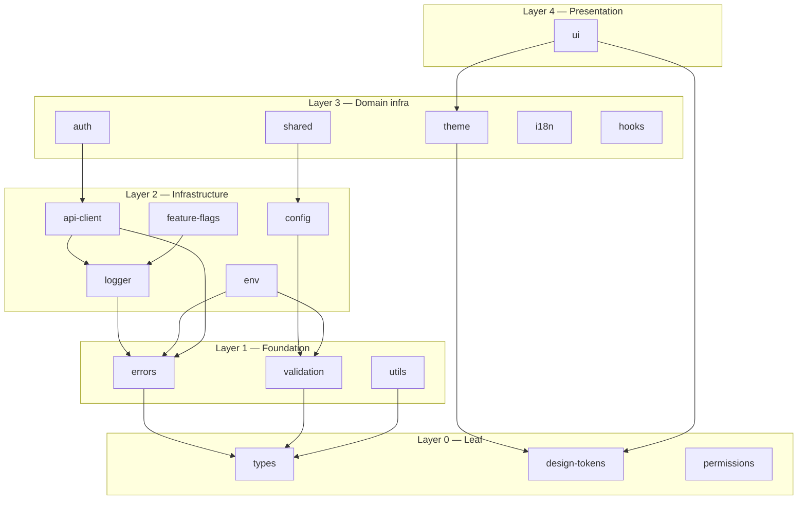

# Package Architecture

## Dependency layers

## Why each package exists

| Package         | Rationale                                                                   |
| --------------- | --------------------------------------------------------------------------- |
| `types`         | Single source of shared interfaces — prevents circular type imports         |
| `errors`        | Unified error normalization across Fetch, Zod, and unknown throws           |
| `validation`    | Central Zod re-export — schemas shared by frontend and backend              |
| `env`           | Fail-fast env parsing with separate client/server entry points              |
| `logger`        | Provider pattern allows Sentry/Datadog without vendor lock-in at call sites |
| `api-client`    | Native Fetch + middleware — no Axios dependency, works in Node 18+          |
| `auth`          | Authentication boundaries separated from API transport                      |
| `permissions`   | RBAC infrastructure reusable in admin UI and backend guards                 |
| `design-tokens` | Tokens as CSS variables — themeable without Tailwind coupling               |
| `theme`         | SSR-safe theme state — no UI components, only CSS variable injection        |
| `i18n`          | Namespace-based i18n ready for lazy-loaded message catalogs                 |
| `feature-flags` | Provider contract for gradual rollouts without app-level branching          |
| `hooks`         | Shared React primitives — avoids copy-paste across Vite apps                |
| `ui`            | Design system boundary — Storybook target in a later section                |

## Backend compatibility

Packages tagged `platform:neutral` are importable by future `apps/backend/*` services.

Packages tagged `platform:web` (`theme`, `i18n`, `hooks`, `ui`) must not be imported by backend services.
