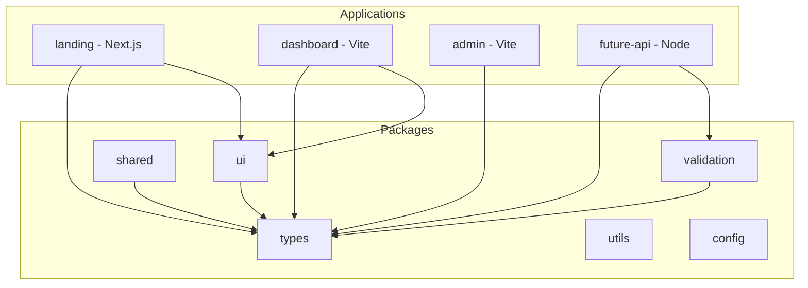

# TypeScript Strategy

## Goals

1. **Single source of truth** for compiler options (`tooling/tsconfig`)
2. **Environment separation** — browser, Node, and isomorphic configs without duplication
3. **Incremental builds** via project references and `composite` libraries
4. **Future backend readiness** without restructuring when Node services are added

## Configuration layers

| Layer            | File                           | Used by                           |
| ---------------- | ------------------------------ | --------------------------------- |
| Strict core      | `base.json`                    | Everything                        |
| Runtime: browser | `browser.json`, `react.json`   | Frontend apps                     |
| Runtime: Node    | `node.json`                    | Future backend services           |
| Buildable libs   | `library.json`, `library-*`    | `packages/*`                      |
| App frameworks   | `nextjs.json`, `vite-app.json` | `apps/frontend-apps/*`            |
| Tests            | `vitest.json`                  | `*.spec.ts`, `tsconfig.spec.json` |

## Project references flow



When using multiple `extends`, **order matters** — later configs override earlier ones. Always extend `tsconfig.base.json` first, then the environment preset:

```json
{
  "extends": ["../../tsconfig.base.json", "@enterprise/tsconfig/library"]
}
```

Package builds use `tsc --build tsconfig.lib.json` for incremental compilation with project references. Application typechecks use `tsc -p tsconfig.app.json --noEmit`.

## Path aliases

Root `tsconfig.base.json` defines `@enterprise/*` paths for IDE resolution and local development. Published packages use their `package.json` `exports` field at runtime.

## What is NOT in base config

- No `DOM` lib — added only in browser presets
- No `@types/node` — added only in Node presets
- No `jsx` transform — added in React presets
- No `composite` / `declaration` — added only for buildable libraries

This prevents frontend assumptions from leaking into shared or backend code.

## Adding a new package

1. Choose preset: `library` (isomorphic), `library-react` (UI), or `library-node` (server-only lib)
2. Create `tsconfig.json` extending the preset with `outDir`, `rootDir`, `include`
3. Add path alias to `tsconfig.base.json`
4. Register project reference in consuming apps/libs
5. Add Nx `project.json` with `build` and `typecheck` targets

## Adding a future backend service

1. Scaffold under `apps/backend/<name>`
2. Extend `@enterprise/tsconfig/node`
3. Tag with `domain:backend`, `platform:node`
4. Import only isomorphic packages — never `ui` or frontend apps
5. Reuse ESLint, Prettier, Vitest configs from tooling (Section 3+)

No Express, Fastify, NestJS, or other backend frameworks are installed until explicitly chosen.
